## Veri iletişimi ve Bilgisayar Ağları - `CENG 403`

# Bölüm 1 - Giriş

> Chapter 1 - Introduction to Computer Networks and the Internet

> Bu bölümle ilgili tüm ders materyallerine [**buradan**](http://gaia.cs.umass.edu/kurose_ross/videos/1/) ulaşabilirsiniz.

---

> **`Bu ilk bölümde tüm konu başlıklarına genel bir bakış atıyoruz. Devamında konular üzerinde derinleşerek devam ediyor olacağız.`**

 

**Bu bölümde bu sorulara cevap arayacağız;**

- Bilgisayar ağları nedir?
- Bilgisayar ağları deyince aklımıza ne geliyor?
- Bilgisayar ağlarını ne oluşturur?
- Bilgisyar ağları neden vardır?
- İnternet nedir? Protokol nedir? İnterneti oluşturan ara-ana elemanlar nelerdir?
- Bilgisayar ağlarında karşımıza çıkan problemler nelerdir ve biz bu promlemlere nasıl çözümler getiririz?

Ve bilgisyar ağlarının temel kavramlarına değiniyor olacağız.

# 1.1 İnternet Nedir?

> What is the Internet?

>**İlgili bölümün [videolu anlatımı](https://www.youtube.com/watch?v=74sEFYBBRAY&feature=youtu.be), [ders anlatım sunumu](http://gaia.cs.umass.edu/kurose_ross/videos/1/1/1.1_video_slides_posted.pptx).**

	<a href="https://www.youtube.com/watch?v=Vywf48Dhyns">
		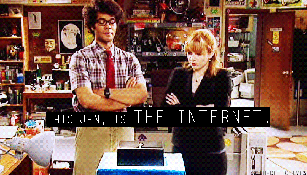
	</a>

Ağların ağıdır. "**network of networks"**

Bu soruyu cevaplamanın birkaç yolu var. İlk olarak, İnternet'i oluşturan temel donanım ve yazılım bileşenlerini tanımlayabiliriz. İkinci olarak da interneti dağıtılmış uygulamalara hizmet sağlayan bir ağ altyapısı olarak tanımlayabiliriz.

Hadi internetin temel yapı taşları ile başlayalım.

## İnternet'nin temel yapı taşları

> The internet: a "nuts and bolts" view

**`İnternet:`** ağların ağı "**network of networks"**

- Birbirlerine ISP'ler ile bağlanırlar.

> ## ISP Nedir?

> **ISP**, *İnternet Servis Sağlayıcısı* anlamına gelen bir kısaltmadır. İnternet Servis Sağlayıcısı, kuruluşlara ve ev kullanıcılarına İnternet erişimi sağlayan bir şirkettir.  

> Kısacası, bir ISP size genellikle bir ücret karşılığında İnternet erişimi sağlar. Bir ISP olmadan, çevrimiçi alışveriş yapamaz, Facebook'a erişemez veya bu sayfayı okuyamazsınız. İnternete bağlanmak için belirli telekomünikasyon, ağ ve yönlendirme ekipmanı gerekir. ISP'ler, kullanıcıların gerekli ekipmanı içeren ağlara erişmesine izin vererek kullanıcıların İnternet bağlantısı kurmasına olanak tanır.  

> **ISS olmadan İnternete bağlanabilir miyim?**  
Hayır, kuruluşların ve ev kullanıcılarının İnternet'e erişebilmek için bir ISS'ye ihtiyacı vardır. ISP'niz çalışmıyorsa, başka bir ISP üzerinden erişiminiz olmadıkça İnternete erişemezsiniz.  

>**[[-1]](https://www.whoismyisp.org/articles/what-is-an-isp)**

**Protokoler** her yerde

- Mesajların yollanmasını, ulaşmasını  kontrol eder.
- Nedir bu protokoller; HTTP (Web), streaming video, Skype, TCP, IP, WiFi, 4G, Ethernet

Internet **standartları;**

- [RFC: Request for comments](https://github.com/hasantezcan/oyk-2020-kis-bilisim-hukuku/blob/master/days/day2.md#rfc---requests-for-comment)
- [IETF: Internet engineering task force](https://en.wikipedia.org/wiki/Internet_Engineering_Task_Force)

Niye bu standartlar var? 

Ortak bir dil konuşularak topluluklar ile çalışmaya başlandığında belirlenen orta yollar hizasında çalışmak.  kg, metre, gibi..

## İnternet servislerine(hizmetlerine) bakış

> The Internet: a “services” view

`İnternet:` Uygulamara hizmet veren **altyapıdır.**

Web, streaming video, multimedia teleconferencing, email, games, e-commerce, social media, inter-connected appliances, …

## Protokol nedir?

> What is a protocol?

### `a) İnsani protokoller:`

Güdelik hayatta farkına varmadan uyguladığımız bir protokolden başlayacak olursak; **`Saat sorma protokolü`!**

- `A:` Merhabalar
- **B:** ***Merhabalar***
- `A:` Saat kaç acaba?
- **B:** ***Saat 20.54***
- `A:` Teşekkürler

Bu normal bir ikili konuşma örneğidir(dialog). 

Karşı tarfın selamınızı almaması durumunda konuşma sonlacak, karşı tarafın Türkçe bilmemesi gibi bir durumda; sizin de bilmediğiniz bir dilse iletşim sona erecek ya da sizin de bildiğiniz bir dilse konuşma o dil ile devam edecek demektir. 

Yani B kişisinin veridiği cevaplara göre iletişimiz başka bir yönde gelişecektir. 

Bu insani bir iletişimde kullanılan iletişim ön tanımını görebilirsiniz.

### `b) Ağ protokolleri`

>Yukardaki örneğe nazaran tek fark insanlar yerini bilgisayarların alması.

İnternettiki tüm iletşim aktiviteleri protokoller ile yönetilir.

	

> A **protocol** defines the **format** and the **order** of messages exchanged between two or more communicating entities, as well as the **actions taken** on the transmission and/or receipt of a message or other event.

---

Internet yapısına daha yakından bakalım..

# 1.2 Ağ cihazları

> The Network Edge

> **İlgili bölümün [videolu anlatımı](https://www.youtube.com/watch?v=k8NmM-hImBU&feature=youtu.be), [ders anlatım sunumu](http://gaia.cs.umass.edu/kurose_ross/videos/1/2/1.2_video_slides_posted.pptx).**

## a. **Network Edge (Uç cihaz)**

İnternete bağlanan herhangi bir cihazı `network edge(uç cihaz)` olarak kabul edebiliriz. Nedir bunlar; bilgisayarlar, sunucular, mobil cihazlar, arabalar, buz dolapları....

  
   
	<em>Network Edge</em>

## b. **Access networks (Ara cihazlar), physical media**

Bu paketleri taşıyan birimleri birbirine bağlayan ara cihazlardır. Bunlar kablolu veya kablosuz olabilir.

  
   
	<em>Access networks</em>

## c. **Network Core ISP**

Bu yukarda bahsetiğimiz birimler mantıksal ya da fiziksel olarak birleştiren birimlere de ISP diyoruz.

- Birbirine bağlanmış router'lar
- Ağların ağı network of networks

  
   
	<em>The network core</em>

---

## `SORU:` Uç cihazlar bir sisteme (bir router'a) nasıl bağlanır?

- Akla gelen ilk ***ev senaryosunda*** kullandığınız cihaz bir access point'e bağlanıyor. Access point ISP'ye bağlanıyor. ISP de sunucuya bağlanıyor olabilir. **`"residential access net"`(konut ağları)**
- Ya da bir ***kahve dükkanında*** bulunan ***ortak ağdan*** bağlanıyor olabilirsiniz. `**"institutional access networks"` (kurumsal erişim ağları)**
- Bunların dışında direkt telefonun **4G/5G**'si ya da **wifi** ile bağlanabilirsiniz. `**"mobile access networks"**` **(mobil erişim ağları)**

# Ağlara erişim - Kablo tabanlı erişim

> Access Networks - cable-based access

Ağlara erişim sağlarken karşımıza çıkan ilk problem: ağa bağlı olan bir çok cihazın verisini bozulmadan ulaşması gereken yere gönderebilmektir.

  

Bunu sağlamak için iki farklı yaklaşımdan yararlanabiliriz. Bunlar `FDM (Frequency Division Multiplexing)` ve TDM dir.

## FDM (Frequency Division Multiplexing)

> frekansa bağlı bölümleme

Bu yaklaşımda verileri tek kablo içinde farklı frenks aralıklarında taşırız. **Pink floyd**'un [**The dark side of the moon**](https://www.youtube.com/watch?v=HW-lXjOyUWo&list=PL3PhWT10BW3Urh8ZXXpuU9h526ChwgWKy&index=1) albüm kapağında da olan -ışık prizması- beyaz ışığın içindeki farklı frekans aralıklarında saklanan renkler buna güzel bir örnektir.

  

## TDM (Time Division Multiplexing)

> zamana bağlı bölümleme

Bu yaklaşımda ise veriler frekans aralıklarına bölünerek değilde bir sıra dahilinde gönderilir. 

Önce **A cihazının** verisi göderilir sonra **B cihazının** verisi ve sonra **C cihazının**...

  
   
	<em>A four-node TDM and FDM example</em>

 

  

> **Topology nedir?**
 
> Topoloji, yüzeylerin ve şekillerin özellikleri ile ilgilenir ancak uzunluk ve açılarla ilgilenmez. Önem verdiği konu, şekiller başka bir şekle dönüştükleri zaman değişmeyen özellikleridir. Topolojide şekiller, her yönü ile çekiştirilebilir. Basitçe ifade etmek istenirse, topolojik nesneleri yırtmadan, kesmeden ve koparmadan, sadece eğip bükerek sürekli bir şekilde bir başka nesneye dönüştürmek mümkündür.

> Örneğin bilgisayar ağları (network), hem fiziksel hem de mantıksal topolojiye dayanmaktadır. Ağ üzerindeki bütün terminaller birbirine bağlıdır. Bu ara bağlantıların haritalanması fiziksel topolojidir, veri akışı ise ağın mantıksal topolojisini belirlemektedir. Başka bir ifade ile fiziksel topoloji, ağın fiziksel tasarımını belirtirken, mantıksal topoloji, bundan bağımsız olarak ağda verilerin nasıl işlendiğini belirtmektedir.

> **[[Ağ topolojileri]](https://mail.ecomputernotes.com/computernetworkingnotes/computer-network/what-is-lan-topologies-explain-each-topology) -** *Bus, star vb...*

 

Bu farklı yerlerden gönderilen verilerin karışmaması için kullanılan belli başlı cihazlar vardır. 

Bu örnekte gösterilen evler **`paylaşılmış bir ağı(shared access network)`** kullanıp internete bu şekilde çıkıyorlar.

# Ağlara erişim - DSL (Digital Subscriber Line)

> Access Networks - digital subscriber line (DSL)

Bir önceki örneğe göre kedimize ait bir üyeliğimiz mevcut **(subscriber line)** ve deminkinin aksine mahallede tek bir ağ yok da herkesin kendi ağı var gibi düşünebiliriz. Tabiki teknik olarak günün sonunda mahalledeki ortak kabloya bağlanacak olan bu ev ağları ISP'lerin müşterilerine suduğu özel hizmetler olarak nitelendiriliyor.

> Bir önceki örnekde **`paylaşımlı (shared)`** bir ağ mevcut iken DSL örneğinde **`evlere atanmış (dedicated)`** bir kablo mevcut.

  
   
	<em>A typical home network</em>

---

Bir konaktan veri nasıl göderiliyordu konuşmuştuk. Bu sefer ise bir mühendislik problemini ele alıcaz. **`Verinin Geçikmesi`**

## Verinin geçikmesi

Veri geçikmesi veri transferinde yaşayacağımız en yaygın problemdir. Oyun oynarken bağlantımız yavaşlayabilir (lag olabilir), canlı yayın izlerken paketler geçikmeli gelebilir...

  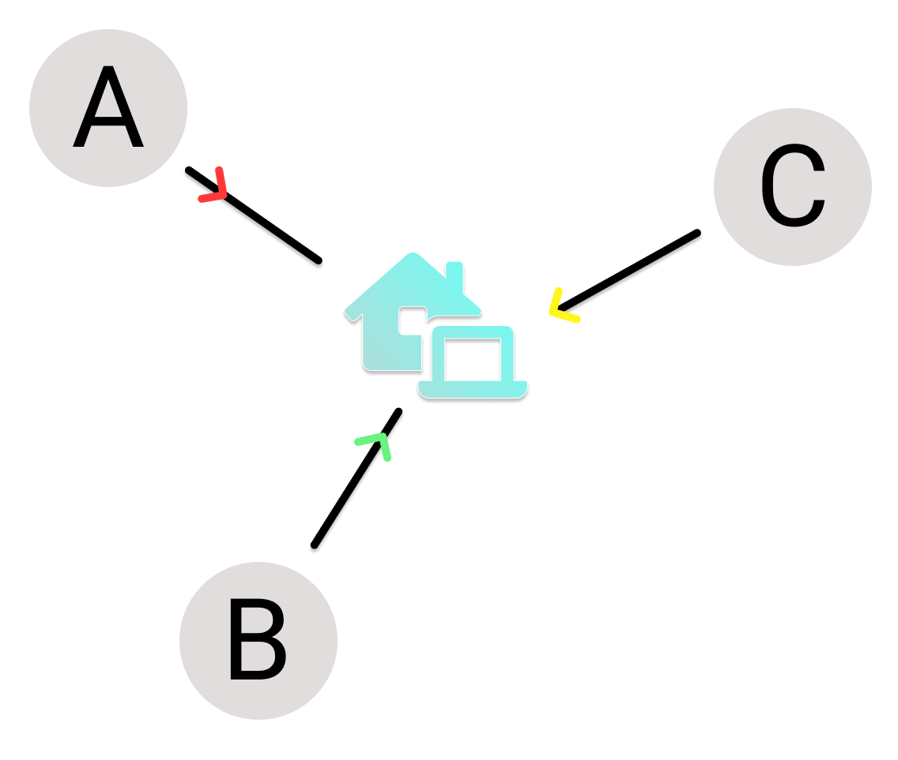

Ya da farklı kaynaklardan gelen veri gelmesi durumunda bunu varış noktasında sıralamamız gerekir. Bu geçikmeleri servis kalitesi için düzenlememiz gerekir.

***Peki bu geçikmeler neden kaynaklanıyor?***

  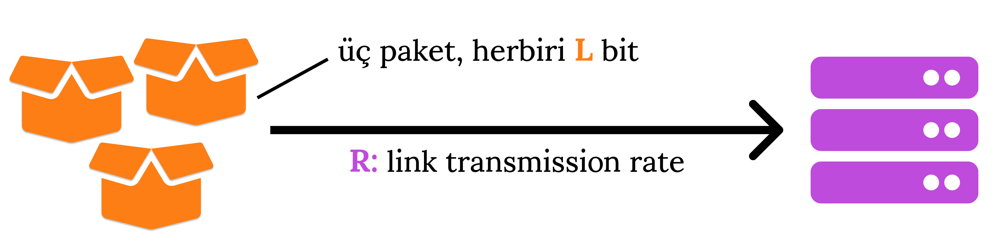

<!-- $$\text {paket iletim gecikmesi} = \frac{L \text { (bits)}}{R \text { (bits/sec)}} $$ -->

  

**L** = paket boyutu

**R** = bağlantı iletim hızı

---

## Bağlantılar: Fiziksel medya

> Links: physical media

Bu bölümde bağlatı kabloları ile ilgili konuşacağız. Fiziksel ders ortamı var oluşursa bir ağ kablosu nasıl çakılır bunu uygulayark göreceğiz. [**RJ453U katogori 5 kabloya nasıl çakılır?**](https://www.youtube.com/watch?v=FYKN0vK6VFk) 

  

**bit:** verici / alıcı çiftleri arasında yayılan bilgicikler

**physical link:** verici / alıcı arasındakiler

**guided media:** belirlenmiş akışı takip eden sinyaller ör: bakır, fiber, coax kabloda yayılan yayınlar.

**unguided media:** serbest yayılan sinyaller ör: radyo sinyalleri

## Twisted pair (TP)

İki yalıtımlı bakır tel

- **Category 5**: 100 Mbps, 1 Gbps Ethernet
- **Category 6**: 10Gbps Ethernet

  

## Coaxial cable

Kablo yayını yapan kablolar.
iki eş merkezli bakır iletken 
iki yönlü (bidirectional)
multiple frequency channels on cable
100’s Mbps per channel

  

## Fiber optic cable

[**Fiber optik kablolar nasıl çalışır?**](https://www.youtube.com/watch?v=0MwMkBET_5I)

- Işık atımları taşıyan cam elyaf, her atım bir bit
- Yüksek hız kapasitesi

    Yüksek hızlı noktadan noktaya iletim (10’lar-100’ler Gbps)

- Düşük hata oranı

  

---

# 1.3 Ağ'ın temeli

> Network core

> **İlgili bölümün [videolu anlatımı,](https://www.youtube.com/watch?v=f1nUcCdQJ8Y&feature=youtu.be) [ders anlatım sunumu.](http://gaia.cs.umass.edu/kurose_ross/videos/1/3/1.3_video_slides_posted.pptx)**

Birbirine bağlı router'lar ağı.

Uç cihazlara destek veren **router** ve **switch** dediğimiz cihazlar mevcut. Bu cihazlar paket switch denilen olayı gerçekleştiriyorlar. Paketi bir yerden alıp anahtarlayıp bir başka konuma iletiyorlar.

  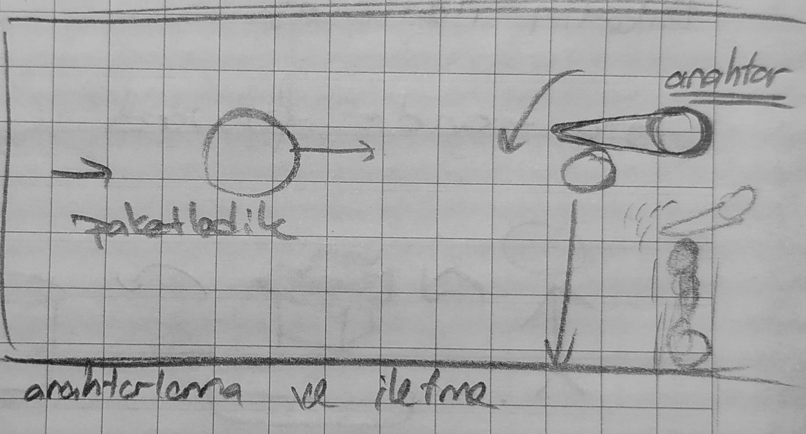

Network Core'da iki temel işlevimiz var bunlar: **Forwarding** ve **Routing**

## **Forwarding**

**Forwarding'i** bir paketi kaynak noktadan hedef noktaya hiç bir aktarma yapmaya gerek kalmadan gerçekleşen paketi iletmi olarak açıklayabiliriz. namıdiğer **switching**. **`Yerel hareket (Local action)`**

> move arriving packets from router’s input link to appropriate router output link

## **Routing**

**Routing** ise bir paketi kaynak noktadan alıp hedef noktaya ulaştırırken arada bu paketin başka taşıyıcılar  arasında el değiştirmesi ile meydana gelir. **`Evrensel hareket (Global action)`**

Yön belirleme. 

> determine source-destination paths taken by packets

<table><tr>
<td> 
  

    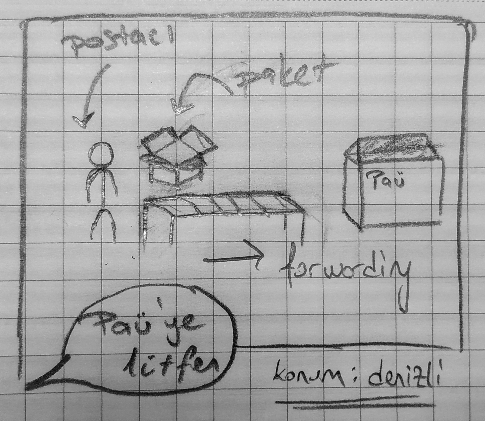
     
    <em style="color: grey">Forwarding (Anahtarlama)</em>
  
 
</td>
<td> 
  

    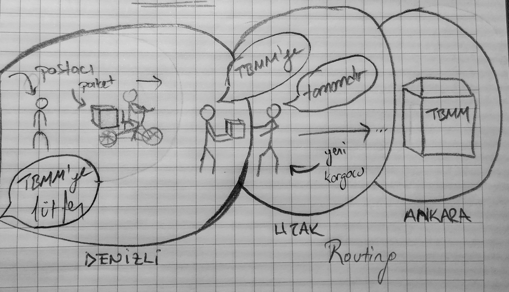
     
    <em style="color: grey">Routing (yönlendirme)</em>
  
 
</td>
</tr></table>

---

## Paketin İletilmesi: saklama ve yönlendirme

> Packet-switching: store-and-forward

  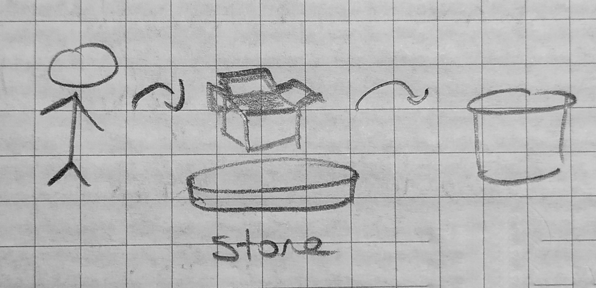

**Neden paketler saklanır? (Paket iletimindeki geçikmeler)**

- Paketin nereye gideceği bilinmiyor olablir.
- Başka paketler bekleniyor olablir.
- Öncesinde göndersmesi gereken paketler mevcuttur.

## Paketin İletilmesi: kuyruk

> Packet-switching: queueing

**`Kuyruk hizmet kapasetisinden fazla talep oluştuğunda meydana gelir.`**

  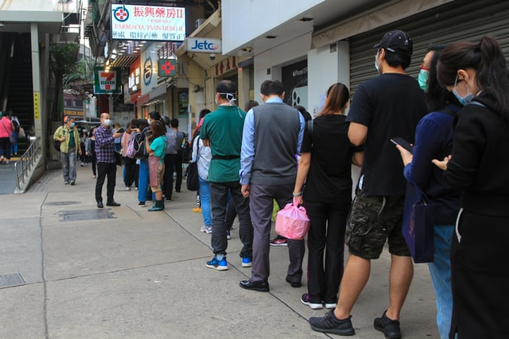

Paket iletilmesinde yaşanan kuyruklarda akla ilk **Paket kaybı yaşanır mı?** sorusu gelir.

- Paket kaybı yaşanması durumunda ne yapılması gerekir?
- Kuyruğu nasıl verimli hale getiririz?

> Bu sorulara ilerleyeden derslerede cevap arıyor olacağız.

  

## Paket anahtarlamaya altarnatif: Devre Anahtarlama

> Alternative to packet switching: circuit switching

Sadece hedefle sizin aranızda sadece sizin kullanımıza açık bir kanaldır.

  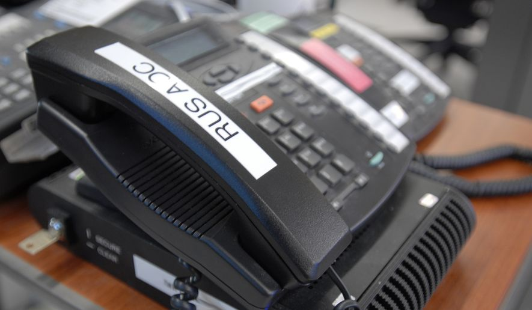

Bunu askeri telefon hatlarına benzetebiliriz. İki cephe arasında iletişim kurmak için sadece birbirine bağlı telefonlar.

> **Devre anahtarlamayı iki uç cihaz arasında doğrudan bir kanal oluşturulması gibi düşünebiliriz.**

<table><tr>
<td> 
  

    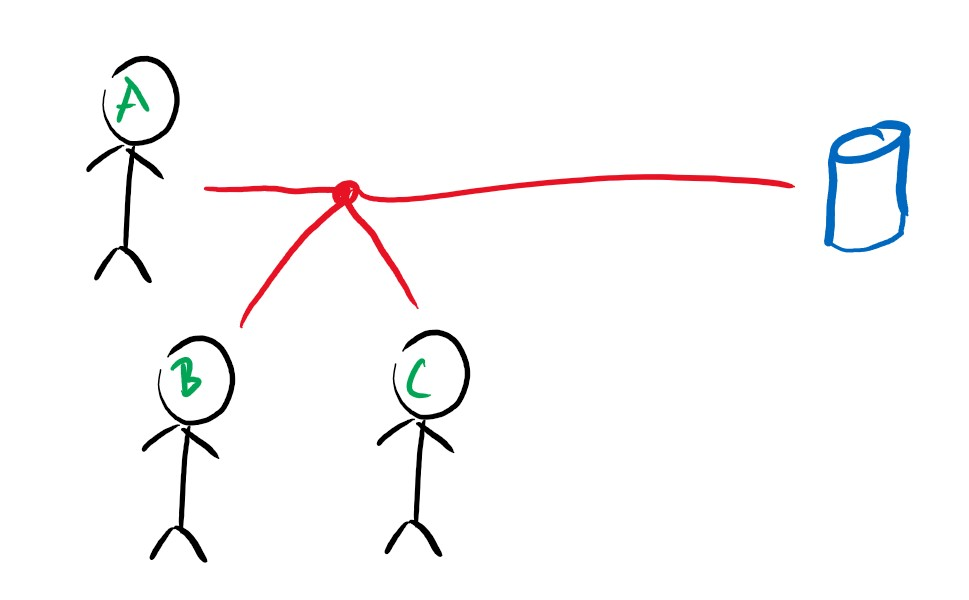
     
    <em style="color: grey">packet switching</em>
  
 
</td>
<td> 
  

    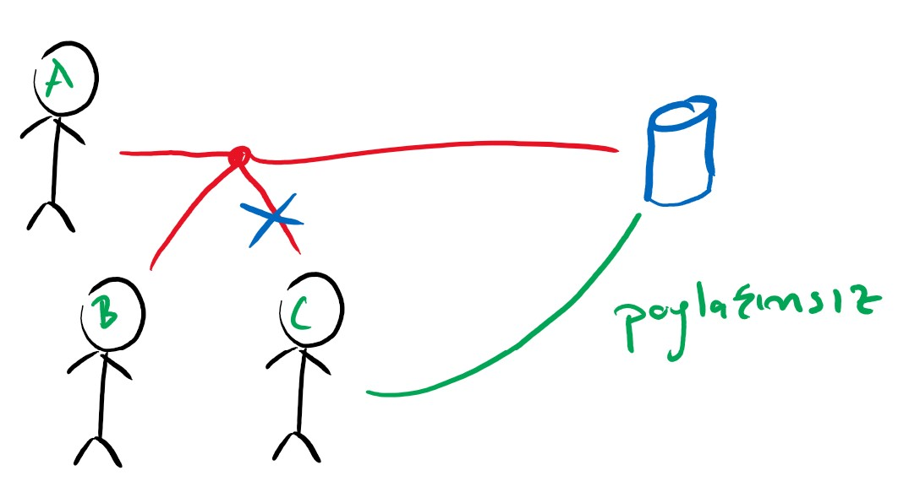
     
    <em style="color: grey">circuit switching</em>
  
 
</td>
</tr></table>

> **Devre anahtarlamanını paket anahtarlamdan en büyük farkı: paylaşımlı bir yapısının olmamasıdır.**

## Devre Anahtarlama: FDM ve TDM

> Circuit switching: FDM and TDM

FDM ve TDM hakkında **The Network Edge bölümünde** zaten konuşmuştuk. İlerleyen bölümlerde bunlardan daha detaylı bahsedicez.

 

## Packet switching vs Circuit switching

> Paket anahtarlama devre anahtarlamaya karşı

<table><tr>
<td> 
  

    
    
 

  ### Packet Switching

- Paylaşımlı kanal kullanımı.(Daha yoğun bir kullanımı mevcut!)
- Daha fazla kullanıcıya hizmet verebilir. Daha yaygın kullanılıyor
- 1 Gbps'lık bir bant genişliğinde yaklaşık 35 kullanıcıya hizmet verebilir. `(Kullcanıcı başı 100Mbps)`
</td>
<td> 
  

    
  

  ### Circut Switching

- Adanmış kanal kullanımı
- Daha maliyetli olduğu için az tercih edilen bir yöntem.
- 1 Gbps'lık bir bant genişliğinde en fazla 10 kullanıcıya hizmet sunabilir. `(Kullcanıcı başı 100Mbps)`
</td>
</tr></table>

## Peki `Packet Switching` , `Circut Switching`'e göre daha baskın bir yöntem mi?

Packet Switching,  çok fazla yönetim ve planlama istier ayrıca aşırı paket aktarımında kuyruk taşmaları sonucu oluşan paket kayıbı problemlerini de gidermek gerekir. 

İletim problemleri, tıkanıklık çalışmaları gibi problemleri dönem içinde iredeleyeyip bu problemleri nasıl çözümleyeceğimize bakcağız.

---

# İnternetin yapısı: Ağların ağı

> Internet structure: a “network of networks”

  

ISP'lerin ne oldğundan bahsetmiştik. `**Peki tüm bu ISP'leri birbirine nasıl bağlarız?**`

  

Tüm ISP'leri birbirine bağlamaya çalşmak **`ölçeklendirebilecek bir bağlantı değildir.`** Peki nasıl bir yol izleyebiliriz?

  

Bir çok olan bu ISP'leri birine bağlamak yerine **`global bir ISP*`**'ye bağlayıp ölçeklendirilebilir bir bağlantı elde edebilirz.

  

Tabi bu evrensel ISP işi makul bir iş tipi olacağından bu hizmeti veren başka **`Evrensel ISP'ler`** de var olacaktır. 

  

Bu evresel ISP'leri de birbirne bağlarken `**IXP (Internet eXchange Point)**` diye isimlendirdiğimiz kıtalar arası yüksek hızlı router'ları kullanıyoruz.

  

Evrensel ISP'ler kadar büyük çaplı olmasa da yine aynı mantıkta çalışan **`Regional (bölgesel) ISP`**'ler de mevcutur.

  

Ayrıca **`içerik sağlayıcı ağlar (content provider networks)`** -ör. Google, Microsoft gibi- hizmetleri ve içeriklerini son kullanıcılara yaklaştırmak için kendi özel ağlarını kullanabilirler.

  

**`tier-1`** ticari ISP'ler:  (Sprint, AT&T, Turkcell, Vodafone vb...) ulusal ya da uluslar arası şirketler.

**`content provider networks`**: (Google, Facebook vb..) Veri merkezlerini **`teir-1`** ve **`regional`** ISP'leri atlayarak internete bağlayan özel ağlar.

> **`SORU:`** **Access ISP'nin şirket bazında örneği nedir?**  
> **`Cevap:`** ?

---

# 1.4 Performans

> Performance: Delay, Loss and Throughput in Computer Networks

> **İlgili bölümün [videolu anlatımı](https://www.youtube.com/watch?v=hm1y4LsphQQ&feature=youtu.be), [ders anlatım sunumu](http://gaia.cs.umass.edu/kurose_ross/videos/1/4/1.4_video_slides_posted.pptx).**

Bu bölümde;
- Bir ağın performansını etkileyen şeyler nelerdir?
- Bir ağın performansını nasıl ölçeriz?

gibi sorulara cevap arayacağız.

## Packet delay: four sources

> Paket geçikmesinin dört kaynağı

  

- **Processing Delay(İşleme geçikmesi):** Paket header'ını incelemek ve paketin nereye yönlendirileceğini belirlemek için gereken süre. **`Processing Delay,` bit-düzeyindeki hataları kontrol etmek gibi** başka sepeblerden de kaynaklanabilir. Bu işlem geçikmesi yüksek seviye router'larda mikrosaniye ya da bununda altındadır. Bu nodal processing'den sonra paket diğer router'a gitme kuyruğuna alınır. -*İlerleyen derslerde (bölüm 4) router'ların nasıl çalıştığına dair ayrıntılara değineceğiz*.-
- **Queuing Delay (Kuyruk geçikmesi)**: Kuyruğun son sırasında olan bir paketin sıranı başına geçene kadar yaşadığı geçikme. Bu kuyruk geçikmesinin uzunluğu kuyruğa alınan ve aktarılmayı bekleyen paketlerin sayısına bağlı olarak değişir.
- **Transmission Delay (Cihaz içi geçikme):**  Router'ın paketi yönlendirirken nereye yönlendireceğini anlaması için gereken sürenin büyüklüğü. (Paketi işledim, paketi etiketledim, okudumi nereye gidecekmiş öğrendim be yönlendirdim) ?!
- **Propagation Delay (İletim geçikmesi):** Bir uç noktadan bir uç noktaya iletim sırsasında yaşanan iletim geçikmesi. Yayılma hızı, bağlantının fiziksel ortamına (yani, fiber optik, bükülü çift bakır tel vb.) bağlıdır

 

<!-- $$dnodal = dproc + dqueue + dtrans +  dprop$$ -->

  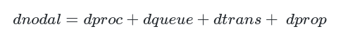

 

[Transmission versus Propagation Delay simulation](https://media.pearsoncmg.com/aw/ecs_kurose_compnetwork_7/cw/content/interactiveanimations/transmission-vs-propogation-delay/transmission-propagation-delay-ch1/index.html)

> **Anoloji (benzeşim);**  
Bir akıl yürütme yolu olarak, iki şey arasındaki benzerliğe dayanan analoji, bu iki şeyden birisi hakkında varılan hükmün ve ulaşılan yargının, diğeri hakkında da geçerli olması anlamına gelir. Bu durumda, bir nesne ya da olay hakkında ileri sürülen bir yargı, ona benzeyen başka bir nesne ya da olay için de geçerlidir. **[[2]](https://www.felsefe.gen.tr/analoji-benzesim-nedir-ne-demektir/)**

## Karavan analojisi

  

## Packet queueing delay

> Paket kuyruğa alma gecikmesi

a: average packet arrival rate - (ortalam paket varış oranı)  
L: packet length (bits) - (paket büyüklüğü)  
R: link bandwidth (bit transmission rate) - bağlantı bant genişliği (bit aktarım hızı)

<!-- $$\text {“traffic 
intensity (yoğunluğu)”} = \frac{L .a}{R} : \frac{ \text{arrival rate of bits}}{\text{service rate of bits}}  $$ -->

  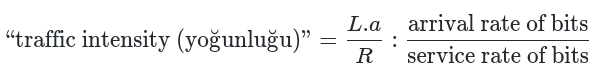

La/R ~ 0: avg. queueing delay küçük  
La/R -> 1: avg. queueing delay büyük  
La/R > 1: verilen hizmetten fazla iş gelmesi durumunda ortalama geçikme sonsuzdur!

  
   
	<em style="color: grey">Dependence of average queuing delay on traffic intensity</em>

  

## “Real” Internet delays and routes

> Gerçek internet üzerinde üzerindeki geçikmeler ve rotalar

**`Traceroute`** araçı; kaynaktan çıkan paketin uç noktaya gidene kadar izlediği yolu ve bu yolda gerçekleşen geçikmeyi bize gösterir.

  

Bu çıktılardan bazı sonuçlara varabiliriz:

- Geçikme sürelerine mesafe tayini yapabiliriz. Özellikle kıta atlamalarında artan geçikmeyi görebiliriz.
- Üç yıldız alamaya başladığımızda artık paketimizin bir cevap alamanığını anlayabiliriz.

Daha fazla bilgi için [www.traceroute.org](http://www.traceroute.org/)

## Packet loss

> Paket kaybı

Sınırlı kapasiteye sahip queue (buna buffer'da deriz) dolduğunda üzerine gelen paketler  kaybolacaktır. 

  

Paket kaybını simule eden bu animasyona [**burdan**](https://media.pearsoncmg.com/aw/ecs_kurose_compnetwork_7/cw/content/interactiveanimations/queuing-loss-applet/index.html) ulaşabilirsiniz.

## Throughput and bandwith

> Throughput ve band genişliği

Bant genişliğini bir otoban örneği üzerinden açıklamak gerekirse; otobanın birim zamanda taşıyabildiği araç sayısına **`bandwidth`** denir. Badwith'i ölçerken büyüklüklerine göre; kilobits per second (kbps), megabits bits per second (Mbps), ve gigabits per second (Gbps) gibi birimler kullanırız. 

ISP'nizden 100Mbps'lık bir internet bağlantısı aldınızğınızı düşünelim. Bu hızda bir internet bağlantısı tekil bir kullanım için günümüz standartlarında gayet tatmin edici nitelikte. Fakat evde yaşan diğer bireyler de ya da kapı komşunuz hatta ve hatta internet parolanız yeterince güçlü değilse alt katta bulunan kahvehanedeki insalar da bu 100Mbps'lık internetinize erişim sağlayıp buradan internete çıkmaya başladığında da siz bu internet bağlantısından aynı randumanı alabilecek misiniz? Ya da internet hız testi yaptığınızda hala 100Mbps bağlantı hızını görebilcek misiniz? 

**Tabiki de hayır.** Bu gibi bir senaryoda ilk başta 100Mbps olan internet hızınız 10Mbps'lara kadar hatta kullanıcı sayısı arttıkça daha da aşağılara düşebilir.

> *Peki neden? Nasıl internet 100Mbps diye aldlığım internet bağlantım bunun altına düşüyor? Benim hızım 100Mbps değil miydi?*

En başta söylediğim üzere tekil bir bağlantıda bu bandwith size çok rahat yetecektir. Yani 5 şeritli bir otobanda en orta şeritten ya da dilediğiniz şeritten 100 Km/s hızla otobanın keyfini süreceksiniz. Fakat bu yola başka arabalar çıktmaya başladığında şeritler yavaş yavaş dolmaya başlayacak en başta yaşadığınız konforlu sürüş deneyiminden ödün vermeye başlayacaksınız. Hele bir de bi kaza olursa işte o zaman ayvayı yediniz! Trafik kilit noktasına gelecek yani internet hızınız 1Mbps'lara kadar düşecek. İnternet hızında bir kaza deneyimini ağınıza bağlı 5 kişinin aynı anda torrent'den filim oyun indirmeye başladğınında nasıl cerayan edeceğini tahmin edin.

Yani demek 100Mbps diye aldığınız internet yanlızca bir bağlantı aralığı `(Bandwith)` değişkenlik gösterebilen bir değer.

Peki değişkenlik göstermeden ne olursa olsun aynı değeri görebileceğim bir internet bağlantı değeri var mı?

Var, değişmeden aynı değeri gösteren internet bağlantı değerine thorugput diyoruz. Throughtput otoban örneği üzerinden gidersek anlık zamanda desteklenen araç sayısı şekilde ifade edilebilir. Bu da nedemek otobanda anlık zamanda geçecek kim varsa aynı hızda geçecek sel de olsa depremde olsa 1000 araba da geçse aynı hızda geçecekler. Bu hız bir şekilde sağlanacak.

Yani ISP'dan throughtput değeri baz alnmış bir internet alırsanız. Yukarda da bahsettiğim gibi tüm ihtimallerden arınmış sabit bir bağlantı almış olacaksınız. Ayrıca throughput'da yine bandwith gibi kilobits per second (kbps), megabits bits per second (Mbps) gibi birimler ile ölçülür.

Tabi bu böyle bir durumda doğal olarak çok daha yüksek değerlerde bir bandwidht değeriniz olacak. Çünkü bu kavramlar birbirleri ile ilişkili kavramlar. Biri varken biri yok olan kavramlar değiller. 

**[[0]](https://www.differencebetween.com/difference-between-throughput-and-vs-bandwidth/), [[1]](https://www.youtube.com/watch?v=A_-L-kn9biw)**

  

Bu örnek olarak benim kendi evimde kullandığım internet bağlantı değerlerim. ISP'ımdan aldığım 25Mbps'lık bant genişliğindeki internet bağlatımdan şu an için 24.4 Mbps'lık bir anlık kullanımım mevcut.

---

# 1.5 Protokol katmanları ve Hizmet Modelleri

> Protocol layers and Their Service Models

> **İlgili bölümün [videolu anlatımı](https://www.youtube.com/watch?v=IZ_PnVXtMeY&feature=youtu.be), [ders anlatım sunumu](http://gaia.cs.umass.edu/kurose_ross/videos/1/5/1.5_video_slides_posted.pptx).**

..

..

..

..

---

# 1.6 Güvenlik

> Networks under attack - Security

**İlgili bölümün [videolu anlatımı](https://www.youtube.com/watch?v=yukwBqSwAkg&feature=youtu.be), [ders anlatım sunumu](http://gaia.cs.umass.edu/kurose_ross/videos/1/6/1.6_video_slides_posted.pptx).**

Ağda bulunan cihazların, ağda gezen paketlerin ağ kullanıcılarının güvenliği bizim için önemli

Ben bir hizmet sağlarken bunu nasıl güvenli verebilirim?

## Packet "sniffing"

> paket koklaması

Wireshark paket sniff için kullanılan araçlardan biri uygulama derslerinde bu araçı kullanacağız.

  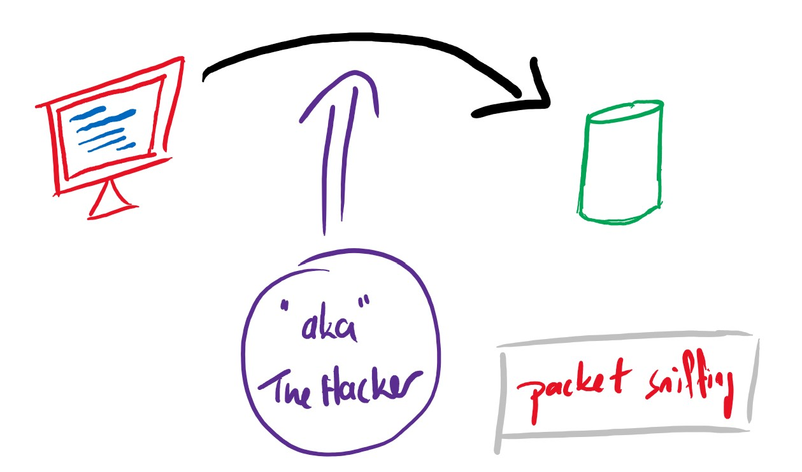
   
	<em style="color: grey">Packet "sniffing"</em>

## Ip spoofing/Fake identity

Kendini başkası gibi gösteriyor.

  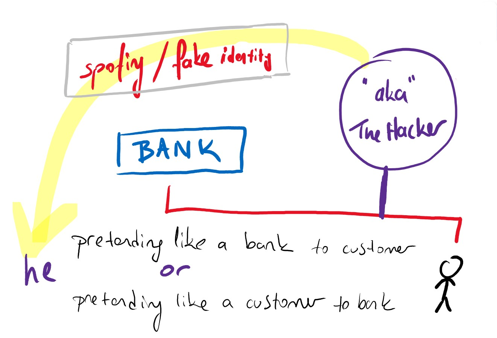
   
	<em style="color: grey">Ip spoofing/Fake identity</em>

## Denial of Service - DOS

> Servis dışı saldırı

Uç cihazların sunucuyu hizmet veremeyecek şekilde trafiğe boğması. Sunucu gelen tüm isteklere yanıt verebilecek bilgiye sahip olsa bile gelen aşırı talep karşısında yetişememeye başlıyor.

**Analoji:** Anaokul öğrecilerinin öğretmenlerini **"Bu ne öğretmenim?"** sorusu ile boğması gibi.

  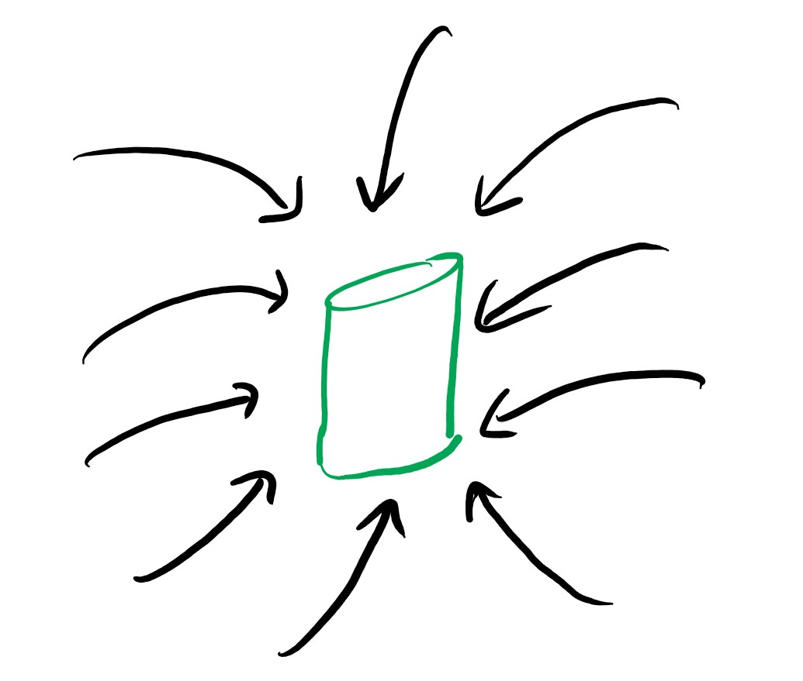

## Defans hattı

> Lines of defense

Bu saldırılara karşı kendimizi nasıl savunacağız?

- **Confidentiality:** Via encryption
- **Integrity checks:** digital signatures prevent/detect tampering
- **Authentication: P**roving you are who you say you are
cellular networks provides hardware identity via SIM card; no such hardware assist in traditional Internet
- **Access restrictions:** password-protected VPNs
- **Firewalls:** specialized “middleboxes” in access and core networks:

güvenlik hakkında bölüm 8'de daha detaylıca konuşuyor olacağız.

# 1.7 İnternet Tarihi

> Internet history

**İlgili bölümün [videolu anlatımı](https://www.youtube.com/watch?v=yukwBqSwAkg&feature=youtu.be), [ders anlatım sunumu](http://gaia.cs.umass.edu/kurose_ross/videos/1/6/1.6_video_slides_posted.pptx).**

..  
..  
..  
..