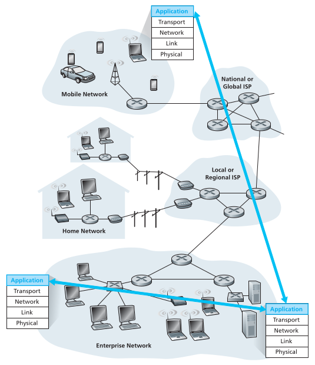
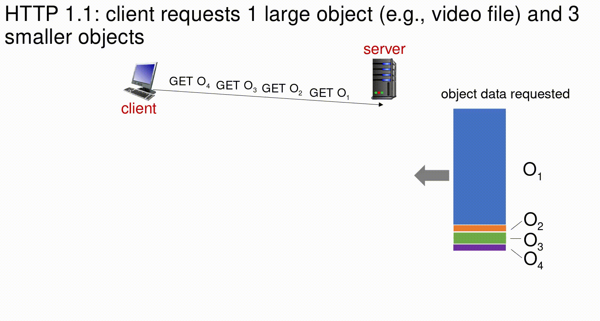
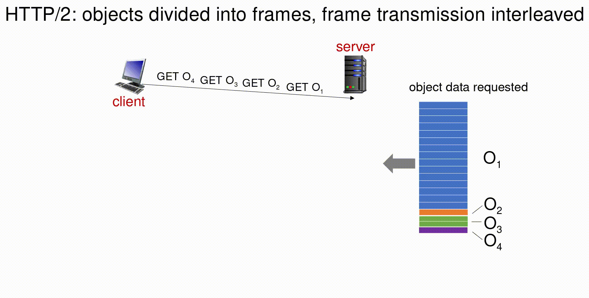

## Veri iletişimi ve Bilgisayar Ağları - `CENG 403`

# Bölüm 2 - Uygulama Katmanı

> Chapter 2 - Application Layer

> Bu bölümle ilgili tüm ders materyallerine [**buradan**](http://gaia.cs.umass.edu/kurose_ross/videos/2/) ulaşabilirsiniz.

---

**Bu bölümde bu sorulara cevap arayacağız;**

- Uygulama katmanının genel yapısı ve servislerden bahsedeceğiz.
- Uygulama katmanı bilgisayarın kullanıcıyla birebir etkileşiminde karşılaştığı katmandır. Bu katmanda uygulamalar ve uygulamalardaki verileri ağa taşıyacak bi takım servisler var ders boyunca bu servislere değiniyor olacağız.
- Uygulama katmanını işlerken uygulama katmanı altındaki diğer katmanlara da değiniyor olacağız fakat bu konuları ilerleyen bölümlerde zaten detaylıca da değineceğiz.

# 2.1 Ağ uygulamalarının ilkeleri

> Principles of network applications

> İlgili bölümün [**videolu anlatımı**](https://www.youtube.com/watch?v=abeupgK5z48&feature=youtu.be), **[ders anlatım sunumu](http://gaia.cs.umass.edu/kurose_ross/videos/2/1/2.1_video_ppt.pptx)**.

> <p align="center">  <code>Genel Bakış:</code> &bull; Applications  &bull; client-server  &bull; P2P  &bull; sockets  &bull; APIs  &bull; transport services </p>

<p align="center">
    
    <br>
    <em></em>
</p>

## Ağ uygulamaları nelerdir?

Ağı yoracak, ağda veri trasnferine neden olacak uygulamalardır. Örneğin;

- Sosyal medya uygulamaları **facebook, twitter** gibi
- Web uygulamaları **medium** gibi
- Mesajlaşma uygulamaları **telegram** gibi
- Dosya trasnfleri yaptığımız uygulamalar
- Video yayını ya da depolaması yaptığımız uygulamalar **youtube, netflix, twitch** gibi
- **(Voice over IP)** IP üzerinden ses uygulamaları **Skype, discord** gibi  ****
- Gerçek zamanlı video görüşme uygulamaları **Zoom, Hangouts** gibi
- İnternet aramaları

Bu tarz uygulamaların uygulama katmanında nasıl yer aldığı ağa  nasıl bir yük getirdiği ile ilgili bir ön çalışma yapıyor olacağız.

## Bir ağ uygulaması oluşturma

> Creating a network app

Bu güne kadar bir ağ uygulaması geliştirdiyseniz genellikle sadece ağ uçlarını düşünerek hareket  etmişsinizdir. Uygulamanın sunucuda ve istemcide nasıl çalışacağına konsantre olmuşsunuzdur. Diğer ağ katmanlarında işlerin nasıl yürüdüğü ile pek ilgenmedik. Mesela;

- Hangi routerdan bu veri nasıl geçecek
- Herhangi bir aksaklık olduğunda uygulama seviyesinde düşündüğüm çözümlerin haricinde daha alt seviyede, mesela fiziksel seviyede bu aksaklığı nasıl giderebilirim

gibi meselerle daha önce hiç ilgilenmedik.

Bunun sebebi ağın katmanlı bir yapısının olması. Bir uygulama geliştiriken uygulama katmanında hareket ederiz, fiziksel katmanda işlemler yapmamıza gerek kalmaz. Orada yaşanan sorunlar kendi katman seviyesine çözülür. 

<p align="center">
    
    <br>
    <em></em>
</p>

## İstemci-Sunucu paradigması

> Client-server paradigm

Biri istekte bulunan bir diğeri de bu isteği karşılamya çalışan iki uç'un paradigması

### Sunucu (server) nedir?

- Her zaman ayakta durmak zorunda (açık olması gereklidir)
    - Örnek televizyon yaynına hep devam eder. Televizyon bir yayımcıdır.
- Sunucunun kalıcı bir IP adresi vardır.
    - Servis veren, referans alınan nokta olduğu için bilinen adresini koruyor.
- Sunucular genelde veri merkezlerinde bulunur.
    - Daha rahat ölçeklendirilebilir olabilmesi için

### İstemci (client) nedir?

- Sunucuların aksine anlık çalışabilirler. Bir başka gruba bi şeyi sevis etmediği için sadece tüketeceği zaman çalışır.
- İstemcinin kalıcı bir adrese ihtiyacı yok.
    - İstediği verileri zaten önceden bildiği sabit adreslerden talep ederek yaşamına devam edebilir.
- Bir veri merkezinde bulunmasına gerek yoktur.

## Peer to peer mimarisi

> Peer-peer architecture

- Sunucuda olduğu gibi herzaman ayakata olan bir sitem yok. Herkes bağlanıp kopabilir.
- Her sunucu aynı zamanda istemci; her istemcide aynı zamnda bir sunucu görevi görebiliyor.
- Konar göçer bir mimari
- Sadece istemcilerin sunuculara bağlandığı bir akış yapısı yok her istemici birbiri ile doğrudan haberleşebilir.
- Ölçeklenebilirlik ağa yeni bir peer'ın (istemcinin) katılması ile mümkün.
- Sabit bir ip adersi yok  Bu sebeple yönetilmesi birazdaha zor. Yönetilebilirilğini sağlamak için listeler kullanılabilir. Her peer'da bir belirleyici bilgi bulunabilir.

<p align="center">
    
    <br>
    <em></em>
</p>

## Processes iletişimi

> Processes communicating

Uygulamalar process'ler üzerinde çalışırlar. Sunucu üzerinde çalışan bu processlerin birbirleri ile haberleşmeleri gerekiyor. 

- Process'ler aynı sunucu üzerindeyseler process'ler arası iletişim (inter-process) ile haberleşirler. *Bu işletim sistemi tarafından tanımlanır.*
- Farklı hostlardaysalar mesaj alışverişi yaparak (by exchanging messages) iletişim kurarlar.

## Soketler

> **Sockets** - 
> *Bu konuya 3.bölümde daha detaylı deyineceğiz.*

Soket uygulama katmanı ile iletim katmanı arasında bir arabirimdir (interface). Uygulama katmanına çalışan process'lerin verisi iletim katmanına soket üzerinden iletilir.

<p align="center">
    
    <br>
    <em></em>
</p>

## Adresleme

> **Addressing processes** -
> *5. ve 6. konularda daha detayli değineceğiz*

Ağ yapısında birçok adres kullanıyoruz. IP adresleri, MAC adresleri, Port adresleri vb.. gibi 

Bu adresler aslında bir process'in **belirtecleridir**. örenğin bir gnu/linux işletim sisteminde bu adresler ile o process'leri durdurabiliriim(kill)

Bu adresler proceller arasında haberleşmeyi, iletişimi sağlarken kullandığımız belirteclerdir.  

**Aynı ip'ye bağlı portlar var bunlar ne işe yarıyor?**

Bir bilgisayarda çalışırken bir yandan müzik dinlerken öbür yandan tarayıcıda gezinebiliriz. Bu durumda tek ip'ye sahip bilgisayarımızın birden fazla sunucu ile habeleşmesi gerekir. İp adresimizle ilişkili olan portlar sayesinde bu habeleşmeyi sağlarız. 80 portunu HTTP istek ve yanıtlarına tahsis etmişken bir başka portu spotıfy için kullanabiliriz.  

## An application-layer protocol defines

> [**Protokol tanımını**](https://github.com/hasantezcan/computer-networks-notes/blob/main/_data/weeks/week1/Compute-Networks-and-the-Internet.md#protokol-nedir) bir önceki bölümde işlemiştik buradan oraya tekrar bakabilirsiniz.

Temel olarak iletişimin nasıl gerçekleştiğini zaten öğrendik. Ama buna ek şeyler de var:

**Mesajları türü,** request, response

**Message syntax (mesaj sözdizimi),** yollanan mesajlar kuralına uygun mu?

**Message semantics** (**Mesajları anlamlandırma),** yani "konuştum ama konuştuğumuz şey anlaşılıyor mu?" gibi. Ben saat soruyorken o, "ben de iyiyim" diyorsa burada bi sıkıntı var demektir. 

**Rules (Kurallar),** iletşim sağlanırken uyulacak kurallar. Bi nevi protokol

- **Open protocols (açık, serbest protokoller)**, RFC'lerde tanımlı olan standart protokollerdir. Herkes bunlara erişim sağlayabilir.
- **Proprietary protocols (tescilli protokoller),** sadece özel kullanımlar için hazırlanmış protokollerdir. Skype, Zoom gibi.

## Bir uygulama hangi iletim servislerine ihtiyaç duyar?

>**What transport service does an app need?** -
> *Bu kısım iletim katmanı bölümünde daha detaylı incelenecektir.*

**Data integrity (Veri bütünlüğü),** İstemciden göderdiğimiz verinin sunucuya arada veri kaybı yaşamadan doğru şekilde gitmesi gerekir. Bu sebeple iletim katmanı, iletim sırasında veri kaybının mimumum düzeyde olacağını garantilemelirdir.

Bazı uygulamalarda bu tolerans mevcutken bazılarında veri iletiminde hata tolerası sıfırdır. Örneğin;

- **Dosya aktarımı, web işlemleri** gibi aksiyonlarda % 100 güvenilir(reliable) veri aktarımı gerekir
- **Ses aktarımı, canlı yayınlar** gibi bazı diğer aksiyonlarda biraz veri kaybı tolere edilebilir.
    - % 100 güvenilir veri aktarımı varken neden böyle bir veri kaybına tamah edelim.

        Bazı durumlarda verinin her türlü gelmesini istersiniz. Biraz eksik olsada veriyi anlık görmek istersiniz örneğin canlı yayınlar gibi bir kaç kare atlasada izlemeye devam edersiniz. Anlık görüntüyü görmek sizin için önemlidir. 

        Bu, tavuklu makarna söyleyip daha tavuğu gelmeden yemeğe başlamaya benzer. Normalde beklemek, ikisini beraber tadını ala ala yemek daha mantıklıdır fakat çok açsam önüme ilk ne gelirse direk yemeğe başlarım. 

**Timing (zamanlama),** bazı uygulamalar için zamanlama önemlidir. Paketlerin istemciden sunucuya belirli bir zaman diliminde ulaşmasını isterler. Bu zaman dilimi aşıldığı zaman performans sorunları başlar. Bu uygulamalara en güzel örnek **çevrimiçi oyunlar**dır. Oyunlarda paket iletim hızı düştüğünde oyun oynanamaz hale gelir. Bu sebeple iletim hızını yüksek tutmak gerekir. Bu tolere edilemezdir.

Tabi bazı uygulamalar için bu zamanlama o kadar da önemli değildir. Örneğin bir **e posta uygulamasının** verileri illa anlık olarak göndermesine gerek yoktur. Bu tür uygulamalarda bu zamanalama aralığını **biraz daha geniş** tutabiliriz. 

<p align="center">
    
    <br>
    <em></em>
</p>

**Throughput,** [bu konuyada bir önceki ders değinmiştik](https://github.com/hasantezcan/computer-networks-notes/blob/main/_data/weeks/week1/Compute-Networks-and-the-Internet.md#throughput-and-bandwith).

Bazı uygulamalar belirli bir throughput değeri isterlerken bazıları elinde ne varsa onla idare eder. 

Örneğin bir doküman indirirken belirli bir thourghput değerine ihtiyaç duymayız. İnternet hızımız yavaşken de bu veri inebilir sadece inme süresi artar. 

Öte yandan bir canlı yayın izlerken belirli bir throughput değerine ihtiyaç duyarız. Bu canlı yayını takılmadan izlemek için gereklidir. Aksi takdirde canlı yayını verimsiz şekilde izler ya da izleyemeyiz.

**Security (Güvenlik),** iletim katmanı ile birlikte hem sunum katmanı hem de oturum katmanı ilgilendirir.

Sunum katmanında veriyi şifreliyoruz

Oturum katmanınıda ise karşı tarafın oturum doğrulamasını yapıyoruz.

Uygulama katmanında bu katmalardan güvenlikle ilgili bilgileri isteyebiliriz.

## Yayıgın uygulamalarda taşıma hizmeti gereksinimleri

> **Transport service requirements: common apps**

<p align="center">
    
    <br>
    <em></em>
</p>

## Internet transport protocols services

Uygulama katmanı olarak bu iki protokolden hizmet alcağım.

### `TCP Transfer Control Protocol`

**TCP Güvenilir bir veri iletimi sağlıyor;** Üçlü el sıkışma. (Three way handshake). Veri iletimini bu kurduğu bağ üzerinden yapıyor bu sebeple veri kaybına izin vermiyor. 

**Flow Control (Akış kontrolü);** Gönderen alıcıyı boğmaz. Sunucu, istemciye saniyede 5 kelime göndersem anlayabilir misin? Fazla gelecekse 3 kelime göndereyim gibi. Uç sistemler ile ilgili bir problem.

**Congestion control (Tıkanıklık kontrolü):** Hat sınırı. Uçlar birbirleri ile anlaştıktan sonra hata bağlı yaşanan kısıtın kontrol edilmesi. Hat ile ilgili bir problem. 

**Connection-oriented (Bağlantı bazlı bir haberleşme sunuyor);** Haberleşmeyi üçlü el sıkışma ile başlatır ve haberleşme boyunca bu bağı korur iletişim bitince bu bağı koparır. 

**TCP neleri sağlamaz;** 

Güvenliği sağlamaz, throughout'u garanti etmez, zamanlama sağlamaz çünkü tıkanıklık takibi veri akışı takibi yapar bunları yaparken zamanlama ile uğraşmaz.

Sadece verinin gittiğine garanti eder  TCP'nin el belirgin özelliği budur.

Zamanlama sizin için önemliyse..

### `UDP User Datagram Protocol`

> Kullanıcı Veribloğu İletişim Kuralları

**Unreliable data transfer (Güvenilir olmayan ver aktarımı);** Verinin gidip gitmediğini garanti etmeden amacı veriyi en hızlı şekilde göndermektir. Zamanlamya çok önem verdiği için veri bütünlüğünü bozma pahasına paketleri gönderir.

**UDP neleri sağlamaz;** 

Connection oriented değil veri bütünlüğünü garanti etmez.

## İnternet uygulamaları ve taşıma protokolleri

> Internet applications, and transport protocols

<p align="center">
    
    <br>
    <em></em>
</p>

## Securing TCP

TCP güvenli değil demiştik. 

`Vanilla TCP ve UDP soketleri:`

- Şifrelenmez
- Cleartext'ler soketlere cleartext olarak gönderilir.

**`Transport Layer Security (TLS)`**

- Şifrelenmiş TCP bağlantıları sağlar
- Data integrity (Veri bütünlüğü)
- End-point authentication (uç nokta kimlik doğrulaması)

**TSL uygulama katmanına nasıl entegre edilir?**

Uygulamalar sırasıyla TCP kullanan TSL kütüphanelerini kullanırlar.

Cleartext'ler soketlere şifrelenmiş olarak gönderilir.

> Bu konun detaylarını 8.Bölümde göreceğiz

Uygulama katmanın genel yapısından ve iletim katmanında ihtiyaç duyduğu bazı alt yapılardan bahsettik. Şimdi HTTP ve Web ile devam edelim.

---

# 2.2 Web ve HTTP

> The Web and HTTP

> İlgili bölümün videolu anlatımı **[[1]](https://www.youtube.com/watch?v=S9GEPaQ1lFs&feature=youtu.be)** **[[2]](https://www.youtube.com/watch?v=4M39gEPWPYs&feature=youtu.be)**, **[ders anlatım sunumu](http://gaia.cs.umass.edu/kurose_ross/videos/2/2/2.2_video_ppt.pptx)**.

> <p align="center"> <code>Genel Bakış:</code> &bull; statelessness  &bull; HTTP messages  &bull; cookies  &bull; caching  &bull; HTTP/2</p>

<p align="center">
    
    <br>
    <em></em>
</p>

Web sayfasları, her biri farklı Web sunucularında saklanabilen **nesnelerden** oluşur

Bu objeler HTML dosyaları, JPEG görselleri, Java uygulamaları, ses dosyaları vb. olabilir.

Web sayfaları, birkaç referanslı nesneyi içeren temel HTML dosyalarından oluşur ve herbiri her biri URL (Uniform Resource Locator) ile adreslenebilir. Örnek;

<p align="center">
    
    <br>
    <em></em>
</p>

## HTTP - Hypertext Transfer Protocol

İstemci sunucu modelinde bir web sayfasının aktarılmasını üstlenecek.

Genel yapıdan bahsetmek gerekirse;

`İstemci (client)` tarayıcı üzerinden bir web sayfasına erişmek isteyecek ve bu sunucuya bir HTTP isteği göndercek bu isteğe karşılık gelen cevabı da `sunucu (server)` başka bir HTTP cevabı ile istemciye iletecek.

Tabi bu cevaplar her zaman aynı olmayacak istek gönderen cihazın türüne göre değişkenlik gösterecektir.

<p align="center">
    
    <br>
    <em>HTTP request-response behavior</em>
</p>

**HTTP, veri kaybına sebep olmayan TCP protokolünü kullanır**

> `Hatırlatma:` TCP bağlantı temelli bir protokoldür. `(Üçlü el sıkışma)`

- **HTTP stateles**'dir yani sunucu, istemcinin geçmişi hakkında bir bilgi (durum / state) saklamaz.

Öteyandan günlük hayatta HTTP ile iletişimini sağladığımız web sayfarında bizimle ilgili verilerin saklandığını, sitenin bizi tanıdığını görmekteyiz. Bizimle ilgili tutulan bu verilerin HTTP ile bir ilgisi bulunmamakta. Bu veriler cookie, çerez dediğimiz yöntemler ile tarayıcılarda saklanmakta bu saklanan durumların HTTP ile doğrudan bir ilişkisi bulunmuyor. HTTP bu habittatta sadece verinin iletişimi ile ilgilienmekte. 

---

İki tür HTTP bağlantısı mevcuttur bunlar;

**1. Kalıcı olmayan HTTP (`Non-persistent` HTTP)**

- Her obje için yeni bir HTTP bağlantısı kurulur.

**2. Kalıcı olan HTTP (`Persistent` HTTP)**

- Tek bir HTTP bağlantısı ile birden fazla objeyi haberleştirebilir.

> İkisininde de haberleşme TCP bağlantısı ile gerçekleşir.

## Non-Persistent HTTP

**RTT** (**Round-Trip Time):** Bir paketin istemciden sunucuya oradan da tekrar istemciye geri dönme süresi. 

- Bağlantı bu değer üzerinden yönetilebilir. "Bağlantı belli bir RTT değeri altındaysa bağlantıyı sonlandır." gibi.

<p align="center">
    
    <br>
    <em></em>
</p>

Back-of-the-envelope calculation for the time needed to request and receive an HTML file

> **Non-persistent HTTP response time = 2RTT+ file transmission time**

---

# 2.2.2 HTTP mesajları
> **HTTP messages**

İki tür HTTP mesajı vardır: **(request) istek**, **(response) yanıt**

HTTP ASCII (human-readable format) tipinde mesaj istiyor.

## HTTP request message

<p align="center">
    
    <br>
    <em></em>
</p>

<p align="center">
    
    <br>
    <em></em>
</p>

General format of an HTTP request message

## HTTP istek metotları

**POST methodu:** belirtilen kaynağa bir varlık (entity) göndermek için kullanılır, bu da genellikle sunucuda bir durum değişikliği ya da yan etkilere neden olur. ****

Bunu web sitelerinin formlarında sıklıkla görebilirsiniz.

**GET methodu:** belirtilen kaynağın bir temsilini ister. GET kullanan istekler yalnızca veri almalıdır. İstek gönderilirken ? ardından kullanıcı verileri dahil edilir.

Örnek: `www.somesite.com/animalsearch?monkeys&banana`

**HEAD metodu:** `GET` isteği ile tamamen aynı olan sadece gövdesi olmayan bir yanıt ister.

**PUT metodu:** Bu metod ile servis sağlayıcı üzerindeki bir kaynağı güncelleyebilirsiniz. Hangi kaynağı güncelleyecekseniz o kaynağın id’sini göndermek zorunludur.

> **[[MDN http request methods]](https://developer.mozilla.org/en-US/docs/Web/HTTP/Methods)**

## HTTP response message

<p align="center">
    
    <br>
    <em></em>
</p>

## HTTP yanıt durumu kodları

- Durum kod'ları, sunucudan istemciye yanıt mesajında 1. satırda görünür.

**Bazı örnek kodlar:**

**`200 OK`:** istek başarılı oldu

**`301 Moved Permanently`:** Bu yanıt kodu, istenen kaynağın URI'sinin değiştirildiği anlamına gelir. Muhtemelen, yanıtta yeni URI verilecektir.

**`400 Bad Request`:** Bu yanıt, sunucunun geçersiz sözdizimi (syntax) nedeniyle isteği anlayamadığı anlamına gelir.

**`404 Not Found`:** İstenen belge bu sunucuda bulunamadı

**`505 HTTP Version Not Supported`:** 505 HTTP Version Not Supported

> **[[MDN HTTP response status codes]](https://developer.mozilla.org/en-US/docs/Web/HTTP/Status)**

# 2.2.3 Cookies

> Çerezler

HTTP'nin stateles olduğundan bahsetmiştik. State tutmak için kullanılan yapının adı cookie'dir.

Cookie'ler istemcide tutulur.

**`Cookie`** HTTP istek başlığı, daha önce sunucu tarafından [`Set-Cookie`](https://developer.mozilla.org/tr/docs/Web/HTTP/Headers/Set-Cookie) başlığıyla gönderilip tarayıcıda saklanmış olan [HTTP çerezlerini](https://developer.mozilla.org/tr/docs/Web/HTTP/Cookies) içerir.

`Cookie` başlığı isteğe bağlıdır ve örneğin tarayıcının gizlilik ayarları çerezleri engellediğinde gözardı edilebilir.

```jsx
Cookie: <cookie-list>
Cookie: name=value
Cookie: name=value; name2=value2; name3=value3
```

**`<cookie-list>`**

`<cookie-adi>=<cookie-degeri>` biçimindeki ad ve değer çiftlerinden oluşan bir liste. Listedeki çiftler noktalı virgül ve boşlukla (`'; '`) ayrılır.

> [**`RFC 6265, section 5.4: Cookie`**](https://tools.ietf.org/html/rfc6265#section-5.4)  
> **[`[MDN - Cookie]`](https://developer.mozilla.org/en-US/docs/Web/HTTP/Headers/Cookie)**

<p align="center">
    
    <br>
    <em>Keeping user state with cookies</em>
</p>


## Cookie'ler ne için kullanılabilir?

- Kimlik doğrulama için kullanılabilir.
- İlgili site ile alakalı belirli bilgileri saklamak için
- Öneride bulunmak için
- Draft yazıları saklamak için 

### **Çerezler Bir Güvenlik Riski Oluşturuyor mu?**

Çerezler doğrudan bir risk oluşturmazlar. Ancak içerdikleri bilgilerin bir şekilde başka web siteleri tarafından okunması durumunda ya da kopyalanmaları durumunda güvenlik açığı ortaya çıkabilir. Örneğin bir web sitesi kullanıcın kullanıcı adı ve şifresini ya da kullanıcıya otomatik bağlanma sağlayan bilgileri çerezlerde saklıyorsa ve çerezler başkaları tarafından elde edilebilirse web sitesine kullanıcı bilgileri ile girilebilir. Web sitesi bağlanan kullanıcıyı sadece çerez bilgilerine güvenerek onaylıyorsa sorun oluşacaktır.

Çerezler özellikle reklamcılıkta kullanılmaktadır. Ziyaret edilen web sitesinin bir reklam sitesine bağlantı vermesi durumunda bağlantı verilen reklam sitesi kullanıcının ziyaret ettiği sayfaları takip edebilmekte ve ona uygun reklamlar çıkartabilmektedir. Ziyaret edilen bir alış veriş sitesindeki ürünün diğer sitelerde reklam olarak görünmesi çerezler yardımıyla yapılmaktadır. **[[devamı]](https://kisiselveri.com/cerez)**

# 2.2.4 Web caches

<p align="center">
    
    <br>
    <em></em>
</p>

Web cach'leri işletim sistemi dersindende hatırladığımız disk cach'leri ile benzerlik gösterir.  **Web önbelleği (Web caches)**, sık erişilen statik içeriği geçici olarak depolamak için kullanılan bir donanım aygıtı veya yazılım uygulamasıdır.

Web cach'i örnek bir senaryo üzerinden anlatmak gerekirse;  

Bir istemci sunucudan bir istek yaptığında bu veri önce web cache üzerinden geçer bu bilgi daha önce web cach de yoksa burada yedeklenir ve gelecek isteklerde tekar bu istek geldiği zaman isteği sunucuya göndermeden cevaplar. Bu yöntem ağ üzerinde bize **çeviklik kazandırır**. **Bandwith tasarrufu sağlar**. **[[1]](https://www.digitalocean.com/community/tutorials/web-caching-basics-terminology-http-headers-and-caching-strategies)**, [**[2]**](https://blog.stackpath.com/web-cache/)

## Bir caching örneği

<p align="center">
    
    <br>
    <em></em>
</p>

**Senaryomuz**

- Acces link rate değerimiz 1.54 Mbps
- Institutional router ile server arasındaki RTT değerinin 2 saniye
- Transfer edilen web nesnesinin boyutunun 100 Kbit
- Tarayıcıdan server'a ortalama istek süresinin 15/saniye yani 1.50 Mbps

**Performans**

- **Access link utilization (Erişim bağlantısı kullanımı)** = **`.97`**

    **Sorun:** yüksek kullanımda büyük kuyruk gecikmeleri!

<p align="center">
    
    <br>
    <em></em>
</p>

- **LAN kullanımı (LAN utilization) =** **`.0015`**

    Diğerinin aksine iç ağda bir doluluk yok. İç ağda bir haberleşme yok. Bu ferahlığın temel sebebide RTT değerinin daha düşük olması.

---

## Bu problemi nasıl çözeriz?

Alt network'deki uç birimler bu sınırlı bağlantıyı kullanarak 100Kbit'lik bir nesneyi indirse dahi ara bağlantıda bir aşır bir yükleme meydana getiriyor. Bu sorunu nasıl çözebiliriz. 

- Bu durumda bir web cahce kullanmanın bana bir avantajı olur mu?
- Başka bir yöntem var mı?

### 1. Erişim bağlantısını arttırmak

Bu sorunda ilk aklımıza gelen çözüm şekli şirket ağı ile herkese açık ağ arasındaki bağlantıyı kuvventlendirmek olur. 1.54 Mbps'lık internet erişimini 154 Mbps yaparsak aradaki darboğaz sorununu çözebiliriz. Bu durumda;

- Institutional network ile public internet arasındaki bağlantımız **`1.54 Mbps`**'dan **`154 Mbps`**'a yükselmiş olacak
- **Access link utilization (Erişim bağlantısı kullanımı)** = <strike>**`.97`**</strike> → **`.0097`**

 Erişim bağlantımız daha hızlı olacak ama bu çözüm pahalı bir çözüm hali hazırdaki bağlantı hızınızı yükseltmeniz gerekecek. Tabi bu da bir maliyet demek.

### 2. Web cache kullanmak

İnternet hızını yükseltip bir maliyet oluşturmak yerine local'de bir web cache kurabiliriz. Bu iş için atanmış özel bir sunucuya ya da ağ bağlantısı güçlü bir uç biriminin içine sanal bir sunucu olarak da web cache'imizi kurabiliriz.

<p align="center">
    
    <br>
    <em></em>
</p>

Hit rate'imiz düşük ise local web cashe bir işe yaramayacak demektir. Çünkü her seferinde farklı verileri internetten talep ediyor olduğundan web cahse bu durumda bize verim sağlayamaz. (Mis fazla olursa web cashe bir işe yaramaz)

> **Hit rate nedir?**

> Cache serverde var olan bir bilgiyi talep ettiğinizde bu **hit (isabet)** olarak adlandırlır. Ama web cache'de mevcut olmayan bir veriyi talep ettiğinizde web cashe size yardımcı olamayaktır ve bu durumda **mis (ıska)** deriz.

> Web cache'in bize fayda sağlaması için hit'lerin daha çok olması gereklidir. Zaten hep mis (ıska) yapıyorsa burada cashe'e pek de gerek yoktur.

Önbellek isabet oranının (cache hit rate) **0,4** olduğunu varsayalım:

İsteklerin %40'ı düşük geçikme ile cashe tarfından sunuluyor.

İsteklerin kalanı yani %60'ı ise public internetten cevaplanıyor.

0.6 * 1.50 Mbps = .9 Mbps

**Access link utilization (Erişim bağlantısı kullanımı)** = **`0.9/1.54 = .58`**

Bu da erişim bağlantısında düşük kuyuruk geçikmesi anlamına gelir.

**Ortalama Geçikme süresi (average end-end delay)**:  
0.6 * (delay from origin servers) + 0.4 * (delay when satisfied at cache) 
= 0.6 (2.01) + 0.4 (~msecs) = ~ 1.2 secs

> 154 Mbps bağlantıya göre daha düşük ortalama gecikme süresi ve daha ucuz bir çözüm.

---

## Şartlı `GET` isteği

> Conditional GET

Normak get isteğinin yanısıra bu istekte bir şart söz konusu. Bir önceki isteiğinden bu yana bir veri güncellemesi olduysa cevap ver yoksa cevap verme gibi bir mantığa dayanıyor.

Örneğin bir futbol maçının sonuçlarını takip ediyorsunuz en son **`2 - 1`** olarak aldığınız yanıtdan sonra istek atmaya devam ediyorsunuz ne zaman bir skor güncellemesi oldu o zaman isteğini yanıt buluyor cevap size **`2 - 2`** olarak gönderiliyor. 

**`client:`** specify date of cached copy in HTTP request 

**`If-modified-since: <date>`**

**`server:`** response contains no object if cached copy is up-to-date:

**`HTTP/1.0 304 Not Modified`**

<p align="center">
    
    <br>
    <em></em>
</p>

---

HTTP'nin diğer versiyonlarına bakcak olursak.

# 2.2.5 HTTP/2

**HTTP/1**'de temel amacımız paket alışverişini sağlamakdı. Bu paketler TCP ile iletilirken kayıp olma, geçikme bazı paketler önce bazıları sonra gitti gibi senkron sıkıntıları meydana gelebiliyordu.

**HTTP/2** **[[RFC 7540]](https://tools.ietf.org/html/rfc7540)** ile birlikte bu sorunlar çözülmeyi amaçladı. Çok nesneli HTTP isteklerinde gecikmeyi azaltmayı amaçladı.

<p align="center">
    
    <br>
    <em></em>
</p>

HTTP/2 İstemcinin belirlediği nesne önceliğine göre nesneleri sıralar ve o şekilde iletir. (FCFS olaması gerekli değil)

<p align="center">
    
    <br>
    <em></em>
</p>

İstek sırasına göre paketler geliyor ama ilk paket en büyük paket olduğu için onun yüklenmesini bekliyoruz FCFS

<p align="center">
    
    <br>
    <em></em>
</p>

Burda ise istek sırasında ilk sırada olan paket en büyük paket olsada önce küçük paketler gönderiliyor ardından ilk istenen büyük paket gönderiliyor buda gereksiz şekilde beklememiz problemini çözmüş oluyor. Band genişliğini de verimli kullanmış oluyoruz. Ve kısmı şekilde tüm paketler yüklenmeme başlamış oldu. **[Time division multiplexing](https://github.com/hasantezcan/computer-networks-notes/blob/main/_data/weeks/week1/Compute-Networks-and-the-Internet.md#tdm-time-division-multiplexing)**

[**[0]**](https://kinsta.com/learn/what-is-http2/),**[[1]](https://imagekit.io/blog/http2-vs-http1-performance/),[2]**

# HTTP/3

Biraz daha iletim katmanını da içine almaya başlıyor. Sunum katmanındaki güvenliği de biraz kapsamaya başlıyor.

Bir uygulama katmanı protokülünden ziyade bir iletim katmanı protokolü olarak çalıştığını görmekteyiz. **[[0]](https://kinsta.com/blog/http3/),[[1]](https://blog.cloudflare.com/http3-the-past-present-and-future/),[[2]](https://en.wikipedia.org/wiki/HTTP/3) - daha detaylı araştırlmalı**

---

# 2.3 E-mail, SMTP, IMAP
> Email

> **İlgili bölümün [videolu anlatımı](https://www.youtube.com/watch?v=D3GMrOMR2dk&feature=youtu.be), [ders anlatım sunumu](http://gaia.cs.umass.edu/kurose_ross/videos/2/3/2.3_video_posted.pptx).**

> <p align="center">  <code>Genel Bakış:</code> &bull; Email infrastructure (mail clients, SMTP servers)  &bull; SMTP  &bull; IMAP</p>

<p align="center">
    
    <br>
    <em></em>
</p>

Bizim için 3 önemli etkeni var 

1. **User againt** İstemcide kullanıcının kullandığı uygulama
2. **Mail servers** Sunuculardaki posta uygulamaları 
3. **Simple mail transfer protocol: SMTP** ve iletimi sağlayan bir protokol

### 1. User Agent
Namı diğer e-posta okuyucu (mail reader)

E postaları yazmayı düzenlemeye ve okumaya  yarayan araç

Gmail, outlook vb. mail client'lar

### 2. Mail Servers

**Posta kutusu (mailbox):** kullanıcı için gelen mesajları içerir

**Mesaj kuyruğu:** outgoing (gönderilecek) e-posta mesajları

### 3. SMTP protocol

e-posta mesajları göndermek için posta sunucuları arasında kurulan protokol

**client (istemci):** e-posta gönderen sunucu

**server (sunucu):** e-posta kabul eden sunucu

<p align="center">
    
    <br>
    <em></em>
</p>

A high-level view of the Internet e-mail system

## SMTP [`RFC 5321`](https://tools.ietf.org/html/rfc5321)

E-posta mesajını istemciden sunucuya (bağlantıyı başlatan posta sunucusu) güvenilir bir şekilde aktarmak için TCP kullanır. Port 25

**Doğrudan aktarım (direct transfer):** Sunucuyu (istemci gibi davranan) alıcı sunucuya gönderme

Aktarımın 3 aşaması;

- SMTP handshaking (greeting)
- SMTP transfer of messages
- SMTP closure (müzakere sonu)

> Command/response interaction (like HTTP)

> **commands:** ASCII text
**response:** status code and phrase

<p align="center">
    
    <br>
    <em></em>
</p>

## Ali'nin Burak'a e-posta gönderdiği bir senaryo 
> Scenario: Alice sends e-mail to Bob
1. Alice, [bob@someschool.edu](mailto:bob@someschool.edu) adresine e-posta göndermek amacıyla kullandığı user agent'ı (kullanıcı aracısı) açar ve e-posta içeriğini hazırlar.
2. Alice’in user agent'ı, SMTP kullanarak posta sunucusuna bir mesaj gönderir; ***mesaj, mesaj kuyruğuna (message queue) yerleşir.***
3. Posta sunucusundaki (mail server) SMTP'nin istemci tarafı **Bob'un posta sunucusuyla** TCP bağlantısını açar
4. SMTP istemcisi Alice'in e-postasını TCP bağlantısı üzerinden gönderir
5. Bob’un posta sunucusu e-postayı Bob’un posta kutusuna yerleştirir
6. Bob, kullanıcı aracısını kullanarak e-postasını okuyabilir.

<p align="center">
    
    <br>
    <em>Alice sends a message to Bob</em>
</p>

<p align="center">
    
    <br>
    <em></em>
</p>

## Kaynakça 

- [Computer networking a top-down approach 8th Edition](http://gaia.cs.umass.edu/kurose_ross/index.html) **J. Kurose & K. Ross**