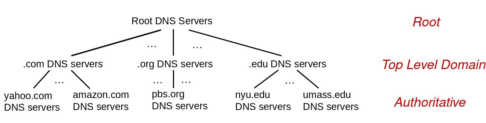
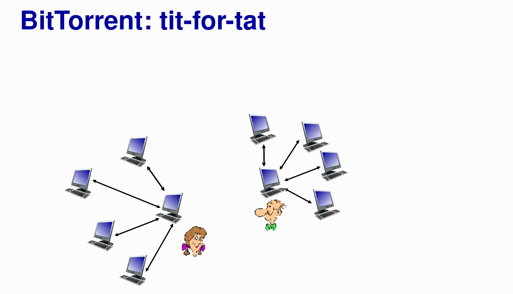
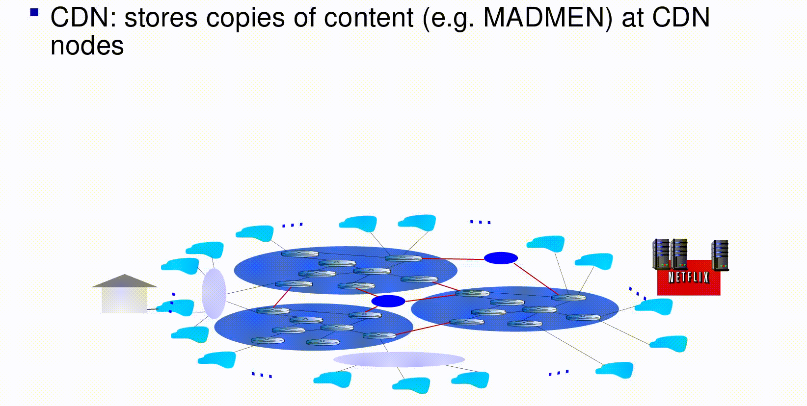

## **Veri iletişimi ve Bilgisayar Ağları - `CENG 403`**

# **Bölüm 2 - Uygulama Katmanı (devam)**

> Chapter 2 - Application Layer (cont)

> Bu bölümle ilgili tüm ders materyallerine buradan ulaşabilirsiniz.

---

Bu bölümde bu sorulara cevap arayacağız;

- Bu derste uygulama katmanının servisleri öğrenmeye devam edeceğiz.
- The Domain Name System DNS
- P2P uygulamaları
- İçerik sağlayıcı ağların uygulama katmanındaki hizmetlerinden burada karşılaştıkları hizmetlerden bahsedeceğiz.
- İletim katmanına geçiş
    - Uygulama katmanın iletim katmanına veri iletmesi için neye ihtiyacı var?
    - İletim katmanı bu gelen veriyi nasıl kontrol ediyor?
- UDP, TCP ve soket programlama

# 2.4 DNS Domain Name System

> İlgili bölümün **[videolu anlatımı](https://www.youtube.com/watch?v=6lRcMh5Yphg&feature=youtu.be)**, **[ders anlatım sunumu](http://gaia.cs.umass.edu/kurose_ross/videos/2/4/2.4_video_posted.pptx)**.

DNS, internet üzerinde hizmet veren sunucuların adreslerini tutan büyük bir rehberdir. Tıpkı telefon rehberleri gibi. Kişilerin telefonlarını bilmek yerine isimleri ile arama yaptığımız telefon rehberleri ile aynı yaklaşımla çalışıyor.

[https://www.youtube.com/watch?time_continue=355&v=72snZctFFtA&feature=emb_logo](https://www.youtube.com/watch?time_continue=355&v=72snZctFFtA&feature=emb_logo)

**Dünyada bir tane mi DNS sunucusu vardır?**

> Why not centralize DNS?

Hayır, herkesin tek bir sunucuya bunu sorması problem yaratabilir.

- Eğer tek olan bu DNS sunucusu çalışmayı durduğunda isimden ip adresi dönüştürmeleri gerçekleştirilemeyecek. Ve kimse aradığı yere ulaşamayacak.
- Milyarlarca cihazdan gelen DNS sorularını tek bir sunucun çözümlemesi, bu devasa trafiğe tek başına göğüs germesi çok da uygulanabilir bir senaryo değildir.
- Tek bir merkezi sunucu olsa bunu dünyada nereye konumlandıracağız. Amerika'ya mı Avrupa'ya mı Hindistan'a mı?
- Bu sunucunun bakımını kim yapacak ya da bu tek olan sunucuyu bakıma aldığımızda DNS sorgularına kim cevap verecek?

Bu sebeplerden ötürü merkezi tek bir DNS sunucsu kullanmıyor, dağıtık bir çok DNS sunusu kullanıyoruz. 

**Örneğin;** Comcast DNS sunucularına günlük gelen DNS sorugları 600 milyar adet, Akamai DNS sunucularaına günlük 2.2 trilyon DNS sorgusu yapılmakta. Bu örneklere de bakıldığında DNS isteklerinin tek bir elden karşılanması yerine dağıtık sistemler ile çözümlenmesinin daha doğru olduğunu görebilmekteyiz.

Tamam bu sunucuyu tek yapmayalım ama ne kadar dağıtalım? 100 sunucuya mı bölelim 1 milyon sunucu mu belirleyelim? Buna nasıl karar vereceğiz?

## Bir DNS nasıl olmalı?

**Güvenli olmalı:** bizi doğru sitelere yönlendirmeli, sahte ayna sitelere yönlendirmemeli. Güvenlir olmayan DNS'leri kullanmamalıyız.

**Organizasyonel, fiziksel olarak merkezi olmayan:** Kayıtlarından sorumlu milyonlarca farklı kuruluş

**Günde trilyonlarca sorguyu işler:** Yazdığından çok daha fazla okuma
performans önemlidir. Hemen hemen her İnternet işlemi DNS ile etkileşir.

**Muazzam dağıtılmış veritabanı:**

## DNS: Dağıtılmış, hiyerarşik bir veritabanı

> DNS: A distributed, hierarchical database

Tek bir DNS ile çalışmamız gerektiğini öğrendik. Peki birden fazla olan bu DNS sunucularını nasıl kurgulayacağız?
- Hiyararşik, dağıtık veritabanı yapısı ile kurgulacağız.

<p align="center">
    
    <br>
    <em></em>
</p>

- En tepede adreslerin bulunduğu ya da sorguların yönlendirildiği bir **root sunucuları** olacak.
- Root sunucuların bi altında **Top Level Domain (TLD)** dediğimiz sunucular olacak. Bunlar; **.com .edu .tr .org**
- **Authoritative DNS sunucuları** ise birimlerde kuruluşlarda kullanılan DNS sunuculardır. Mesela Pamukkale Üniversitesi'nin kendi DNS sunucusu var. Bunun altında kendi domainlerinin kayıtları mevcut.

### Senaryo

Bir istemci [www.amazon.com](http://www.amazon.com/) sayfasını açmaya çalıştı. Bu durumda hangi adımlar gerçekleşir?

- İstemci .com DNS sunucusunu bulmak için root sunucuyu sorgular.
- İstemci, [amazon.com](http://amazon.com/) DNS sunucusunu almak için .com DNS sunucusunu sorgular.
- İstemci [www.amazon.com](http://www.amazon.com/) için IP adresi almak üzere [amazon.com](http://amazon.com/) DNS sunucusunu sorgular.

Bir web sayfasının yüklenmesiyle ilgili 4 DNS sunucusu vardır:

**[DNS recursor](https://www.cloudflare.com/en-gb/learning/dns/dns-server-types/#recursive-resolver):** Recursor, kütüphanenin belirli bir yerdeki kitabı bulması istenen bir kütüphaneci olarak düşünülebilir. DNS recursor, web tarayıcıları gibi uygulamalar aracılığıyla istemci makinelerden sorgu almak için tasarlanmış bir sunucudur. Tipik olarak recursor, istemcinin DNS sorgusunu karşılamak için ek isteklerde bulunmaktan sorumludur.

**[Root nameserver](https://www.cloudflare.com/en-gb/learning/dns/glossary/dns-root-server/):** Root server, insan tarafından okunabilir ana host adlarının IP adreslerine çevrilmesinin (çözümlenmesinin) ilk adımıdır. Bir kütüphanedeki farklı kitap raflarına işaret eden bir dizin gibi düşünülebilir. Diğer bir tabirle bu serverlar dns isteiğinin alt kollardaki sunuculara ulaşmasında bir referans görevi görür.

DNS sisteminin en üstünde bulunurlar ve sunucu adı – ip dönüşümünün başladığı yerdir. Gelen istekleri TLD (Top Level Domain – Üst düzey Etki Alanı) sunucularına yönlendirirler.

Root DNS'leri ICANN belirler/yönetir. 

Ülkemizde bulunan, Root DNS IP’lerine bağlı serverlar;

- University of Maryland – İstanbul
- ICANN – İstanbul
- ICANN – Ankara
- NASA – İstanbul
- Netnod – Ankara

**[TLD nameserver](https://www.cloudflare.com/en-gb/learning/dns/dns-server-types/#tld-nameserver):** Top level domain server (TLD), bir kitaplıktaki belirli bir kitap rafı olarak düşünülebilir. Bu ad sunucusu, belirli bir IP adresini aramada sonraki adımdır ve bir hostname'in son bölümünü barındırır. (Örneğin [example.com](http://example.com/)'da TLD sunucusu **"com"** dur).

**[Authoritative nameserver](https://www.cloudflare.com/en-gb/learning/dns/dns-server-types/#authoritative-nameserver):** Bu son nameserver, belirli bir adın tanımına çevrilebildiği bir raf kitap üzerindeki bir sözlük olarak düşünülebilir. Yetkili ad sunucusu, ad sunucusu sorgusundaki son duraktır. Yetkili ad sunucusunun *(authoritative name server)* istenen kayda erişimi varsa, istenen ana bilgisayar adı için IP adresini ilk isteği yapan DNS Recursor'a (kütüphaneciye) geri döndürecektir.

## Local DNS name server'leri

Kendiniz de bir DNS sunucusu oluşturabilirsiniz istediğiniz IP'leri istediğiniz domain'ler ile ilişkilendirebilirsiniz. 

Tabi bu durum güvenlik sorunlarını da orataya çıkarabilir. Fason siteleri kendi domain name server'inizde bilinen domain ile servis edip kişilerin hassas bilgilerine domain adıyla güven vererek ulaşabilirsiniz. 

---

# DNS Sorgu türleri nelerdir?

Tipik bir DNS aramasında üç tür sorgu gerçekleşir. Bu sorguların bir kombinasyonunu kullanarak DNS çözümlemesi için optimize edilmiş bir işlem, daha hızlı cevap almamızı sağlar.

3 tür DNS sorgusu mevcuttur.

## DNS name resolution: Iterated query

> DNS adı çözümlemesi: Yinelenen sorgu

**Örnek:** **engineering.nyu.edu**'daki host, **gaia.cs.umass.edu** için IP adresi istiyor

Sorgu gönderilirken iterated (yinelenen) olarak gönderiliyor.

**Iterated query:** DNS istemcisi bir DNS sunucusunun yapabileceği en iyi yanıtı döndürmesine izin verecektir. Sorgulanan DNS sunucusunun sorgu adı için bir eşleşmesi yoksa, daha düşük bir değer için yetkili bir DNS sunucusuna bir başvuru döndürür._?!!

<p align="center">
    
    <br>
    <em>Iterated query schema</em>
</p>

- Local DNS serverin root DNS'e sorması ile client'ın direk root DNS sorması arasında bir performans farkı vardır. Bu şekilde gördüğümüz azaltmış bir DNS sorgusu yöntemidir.
- Gördüğünüz gibi bir ismin sorgulanması için 4 sorgu 4 cevap gerekti. **gaia.cs.umass.edu** için tekrar bir sorgu yapıldığı taktirde eğer local DNS bunu cache'inde tutuyorsa bu istek cevap trafiğine gerek kalmadan direk cevap verecektir.

## DNS name resolution: Recursive query

> DNS adı çözümlemesi: Özyinelemeli sorgu

Yine **engineering.nyu.edu**'daki host, **gaia.cs.umass.edu** için IP adresi istiyor fakat bu sefer DNS sorgusu recursive olarak yapılıyor.

Iterated sorgudan farklı olarak local DNS bu kez her sorguda root DNS ile konuşmak zorunda. Adresi root DNS'e sorduktan sonra tüm aşamalar recursive olarak gerçekleşiyor. Root DNS gidip TLD'ye soruyor o da authoritative'e sonrasında cevap yine sorularda olduğu kademe kademe geri geliyor. Local DNS hem sorgunun hem de cevabın elden ele aktarılmasını beklemiş oluyor. 

Bu durum Root DNS'e ekstra bir yük getirecektir. Local DNS'e gelen bütün sorgularına cevap vermek durumda olacaktır.

Iterated sorguda bu böyle değildi DNS serverler ile direk kedisi konuşyor cevabı aracısız olarak temin ediyordu. Bu iterated query ile recursive query arasındaki en büyük farktır. 

<p align="center">
    
    <br>
    <em>Recursive query schema</em>
</p>

**Bu iki DNS sorgusu türünü şu şekilde örnekleyebiliriz:**

Yoldan geçen bir kişiye falanca pastanenin yerini sorduğunuzu düşünün. "O bi dk kardeşim bakkala bir sorayım." diyerek gidiyor. Bakkal "Bi dk kardeşim şu polis onu bilir." diyerek gidiyor. Sonra polis amirine soruyor. Amir cevabı polise veriyor, polis cevabı bakkala veriyor, bakkal da en başta sizin sorduğunuz adama. En son adam gelip size adresi söylüyor. Bu durumu recursive sorguya benzetebiliriniz.  

Iterated sorguda ise yoldan geçen adam "Kardeşim bakkala sor." diyor. Bakkal "Kardeşim polise sor." diyor. Polis "Kardeşim amirime sor." diyor. Ve siz direkt muhataplarla muhatap oluyorsunuz. Ek aracıları beklemekten tasarruf ediyorsunuz.

## [Non-recursive query](https://www.cloudflare.com/en-ca/learning/dns/what-is-dns/#:~:text=Non-recursive%20query%20-)

..  

..  

..

## DNS Bilgilerini Önbelleğe Alma

> Caching DNS Information

Cache'de domain name ve ip adreslerini tutarsak cache'den hızlıca cevap verilebilecektir. 

- Cashe'lemek geri dönüş zamanını geliştirir!
    - TLD sunucuları genellikle local nameserver'ları cashe'ler (önbelleğe alır)
- Burda bir handikap var: **Ip adresi değişmiş olabilir (out-of-date)!** Bu durumda cashe kalıcı olmamalıdır. Arada tekrar sorgulanıp güncel referanslar cashe olarak saklanmalıdır.

---

# DNS Records

> DNS kayıtları

DNS: Kaynak kayıtlarını depolayan dağıtılmış veritabanı.

**RR format:** `(name, value, type, ttl)`

## **`type = A`  [[RFC 1035]](https://tools.ietf.org/html/rfc1035)**

Buradaki "A", adres anlamına gelir ve bu en temel DNS kaydı türüdür. Belirli bir alanın IP adresini belirtir. 

Örneğin, [cloudflare.com](http://cloudflare.com/)'un DNS kayıtlarını alırsanız, A kaydı şu anda 104.17.210.9 şeklinde bir IP adresi döndürür.

A kayıtları yalnızca **IPv4** adreslerini tutar. Bir web sitesinin **IPv6** adresi varsa, bunun yerine bir **"AAAA"** kaydı kullanır. 

Aşağıda bir A kaydı örneği verilmiştir:

<div class="record-table">
<table>
<tr>
<th>example.com</th>
<th>record type:</th>
<th>value:</th>
<th>TTL</th>
</tr>
<tr>
<td>@</td>
<td>A</td>
<td>192.0.2.1</td>
<td>14400</td>
</tr>
</table>
</div>


Bu örnekteki "@" sembolü, bunun kök alan için bir kayıt olduğunu ve "14400" değerinin saniye cinsinden listelenen TTL (geçerlilik süresi) olduğunu belirtir. A kayıtları için varsayılan TTL 14400 saniyedir. Bu, bir A kaydı güncellenirse, yürürlüğe girmesinin 240 dakika (14400 saniye) süreceği anlamına gelir. **[[cloudflare.com/what-is-a-DNS-A-record?]](https://www.cloudflare.com/en-ca/learning/dns/dns-records/dns-a-record/)**

## **`type = CNAME`**

"canonical name (kabul edilmiş doğal isim)" CNAME kaydı, bir domain veya subdomain başka bir domain'in takma adı(alias'ı) olduğunda bir A kaydı yerine kullanılır. CNAME kayıtları, hiçbir zaman bir IP adresine değil bir domain'e işaret etmelidir. Bir domain'i veya subdomain'i başka bir domain'e iletir, bir IP adresi SAĞLAMAZ.

CNAME kayıt tipini farklı domain'leri tek bir domain'de birleştirmek istediğimizde kullanabiliriz. Örneğin sitemizde `example․com` ve `www․example․com` gibi iki farklı adresi CNAME ile tek `example․com`'da birleştirebiliriz. 

CNAME'i aynı zamanda farklı bir domain'e yönlendirme amacı ile de kullanabiliriz. Örneğin benim blogum GitHub tarafından `hasantezcan․github․io`'da sunuluyor. Ben Namecheep'de `hasantezcan.dev`'in `www subdomain`'i için bir CNAME kaydı eklersem ve bunu `hasantezcan․github․io`'a yönlendirsem. [`www.hasantezcan.dev`](http://www.hasantezcan.dev) artık direkt `hasantezcan․github․io`'ya yönlenecektir. 

**[[cloudflare.com/what-is-a-DNS-CNAME-record?]](https://www.cloudflare.com/en-ca/learning/dns/dns-records/dns-cname-record/)**

CNAME kaydı örneği:

<div class="record-table">
<table>
<tr>
<th>blog.example.com</th>
<th>record type:</th>
<th>value:</th>
<th>TTL</th>
</tr>
<tr>
<td>@</td>
<td>CNAME</td>
<td>is an alias of example.com</td>
<td>32600</td>
</tr>
</table>
</div>

## `type = MX record`

Bir DNS 'mail exchange' (MX) kaydı, e-postayı bir posta sunucusuna yönlendirir.

MX kaydı, e-posta iletilerinin Basit Posta Aktarım Protokolüne (Simple Mail Transfer Protocol (SMTP, tüm e-postalar için standart protokol)) göre nasıl yönlendirilmesi gerektiğini belirtir. CNAME kayıtları gibi, bir MX kaydı da her zaman başka bir domain'i işaret etmelidir.

MX kaydı örneği:

<div class="record-table">
<table>
<tr>
<th>example.com</th>
<th>record type:</th>
<th>priority:</th>
<th>value:</th>
<th>TTL</th>
</tr>
<tr>
<td>@</td>
<td>MX</td>
<td>10</td>
<td>mailhost1.example.com</td>
<td>45000</td>
</tr>
<tr>
<td>@</td>
<td>MX</td>
<td>20</td>
<td>mailhost2.example.com</td>
<td>45000</td>
</tr>
</table>
</div>

Bu MX kayıtlarının domain'lerinden önceki 'priority' numaraları tercihi gösterir. Daha düşük 'öncelik (priority)' değeri tercih edilir.

Sunucu her zaman ilk olarak mailhost1'i deneyecektir. Çünkü 10 20'den küçüktür. Mesaj gönderme hatası olursa, sunucu varsayılan olarak mailhost2'yi kullanacaktır.

E-posta hizmeti ayrıca bu MX kaydını, her iki sunucunun da eşit önceliğe sahip olması ve eşit miktarda posta alması için yapılandırabilir. Bu yapılandırmada e-posta sağlayıcısının iki sunucu arasındaki yükü eşit şekilde dengelemesini sağlar.

**[[cloudflare.com/what-is-a-DNS-MX-record?]](https://www.cloudflare.com/en-ca/learning/dns/dns-records/dns-mx-record/)**

## `type = TXT record`

DNS "text (metin)" (TXT) kaydı, bir domain yöneticisinin Domain Name Sistemine (DNS) metin girmesine izin verir.TXT kaydı başlangıçta insan tarafından okunabilir notlar için bir yer olarak tasarlanmıştı. Ancak, artık makine tarafından okunabilen bazı verileri TXT kayıtlarına koymak da mümkündür. Bir alanda birçok TXT kaydı olabilir.

TXT kaydı örneği:

<div class="record-table">
<table>
<tr>
<th>example.com</th>
<th>record type:</th>
<th>value:</th>
<th>TTL</th>
</tr>
<tr>
<td>@</td>
<td>TXT</td>
<td>This is an awesome domain! Definitely not spammy.</td>
<td>32600</td>
</tr>
</table>
</div>

Günümüzde, DNS TXT kayıtlarının en önemli kullanımlarından ikisi, e-posta spam önleme ve etki alanı sahipliği doğrulamadır, ancak TXT kayıtları başlangıçta bu kullanımlar için tasarlanmamıştır.

**[[cloudflare.com/what-is-a-DNS-txt-record?]](https://www.cloudflare.com/en-ca/learning/dns/dns-records/dns-txt-record/)**

## `type = NS record`

NS, "nameserver" anlamına gelir ve ad nameserver kaydı, o alan için hangi DNS sunucusunun yetkili olduğunu gösterir (ör. hangi sunucu gerçek DNS kayıtlarını içerir). Temel olarak, NS kayıtları İnternet'e bir etki alanının IP adresini bulmak için nereye gideceğini söyler. Bir domain'de genellikle, o domain için birincil ve yedek nameserver'ları gösterebilen birden çok NS kaydı bulunur. Düzgün yapılandırılmış NS kayıtları olmadan kullanıcılar bir web sitesini veya uygulamayı yükleyemez.

NS kaydına bir örnek:

<div class="record-table">
<table>
<tr>
<th>example.com</th>
<th>record type:</th>
<th>value:</th>
<th>TTL</th>
</tr>
<tr>
<td>@</td>
<td>NS</td>
<td>ns1.exampleserver.com</td>
<td>21600</td>
</tr>
</table>
</div>

NS kayıtlarının hiçbir zaman CNAME kaydını gösteremeyeceğini unutmayın.

**Nameserver;** bir tür DNS sunucusudur. A kayıtları, MX kayıtları veya CNAME kayıtları dahil olmak üzere domain için tüm DNS kayıtlarını depolayan sunucudur.

**[[cloudflare.com/what-is-a-DNS-NS-record?]](https://www.cloudflare.com/en-ca/learning/dns/dns-records/dns-ns-record/)**

## DNS Mesajları

> DNS Messages

*DNS query (sorgu) ve yanıt (reply) mesajlarının her ikisi de aynı biçime sahiptir:*

<p align="center">
    
    <br>
    <em></em>
</p>

`Message header:` 

- **identification:** 16 bit # for query, reply to query uses same #
- **flags:** Query or reply, recursion desired, recursion available, reply is authoritative
- **other:**
    - name, type fields for a query
    - RRs in response to query
    - records for authoritative servers
    - additional “ helpful” info that may be used

## DNS sorgusu ne ile gönderilir `UDP` ya da TCP?

DNS sorgusu tekrar sorulabilir bir sorgu olduğu için UDP ile gönderilebilir.

- "-Sana bir soru sorucam. + Sor! - Soruyorum" gibi bir üçlü el sıkşma ile sormayız (TCP).

Bunun yerine: - Bir sorgum var bunun cevabını doğrudan bana gönder gibi bir soru ile sorabiliriz (UDP).

## **DNS Veritabanına Kayıt Ekleme**

> Inserting Records into the DNS Database

Bir örnek üzerinden gidelim.

**Senaryo:** Yeni bir girişim başlatıyoruz, adı da "Yırttık Abicim"

İlk olarak [yirttikabicim.com](http://yirttikabicim.com)'u bir DNS kayıt sitesine kayıt ettirmemiz gerekiyor. (ör [https://www.namecheap.com/](https://www.namecheap.com/)) 

- Kayıt şirketi NS, A RR'leri .com TLD sunucusuna ekler:

    ```js
    (yirttikabicim.com, dns1.yirttikabicim.com, NS)
    (dns1.namecheap.com, 212.212.212.1, A)
    ```

212.212.212.1 IP adresiyle yerel olarak authoritative server oluşturun

- type A record for **www.yirttikabicim.com**
- type MX record for **yirttikabicim.com**

## DNS security

[https://github.com/hasantezcan/computer-networks-notes/blob/main/_data/weeks/week3/dns-security.md](https://github.com/hasantezcan/computer-networks-notes/blob/main/_data/weeks/week3/dns-security.md)

daha fazla dns için **[[0]](https://medium.com/@gokhansengun/dns-nas%C4%B1l-%C3%A7al%C4%B1%C5%9F%C4%B1r-98c61cf36f0b), [[1]](https://medium.com/@calganaygun/dns-nedir-nas%C4%B1l-%C3%A7al%C4%B1%C5%9F%C4%B1r-e907859844f3)**

---

# 2.5 P2P uygulamalar

> P2P applications

> İlgili bölümle alakalı **[sorular.](http://gaia.cs.umass.edu/kurose_ross/interactive/CS_vs_P2P_download.php)**

<p align="center">
    
    <br>
    <em></em>
</p>

**Peer-to-peer** ya da **P2P** olarak tanımlanır. Peer eş, denk demektir. İki veya daha fazla [istemci](https://tr.wikipedia.org/wiki/%C4%B0stemci) arasında veri paylaşmak için kullanılan bir [ağ protokolüdür](https://tr.wikipedia.org/wiki/A%C4%9F_protokol%C3%BC).

Eşler, sunucuları veya sabit bilgisayarlar tarafından merkezi koordinasyon ihtiyacı olmadan, işlemci gücü, disk depolama veya ağ bant genişliği gibi kendi kaynaklarının bir kısmını, doğrudan diğer ağ katılımcıları için kullanılabilir yapabilir. Sadece sunucuların tedarikçi ve istemcilerin tüketici olduğu geleneksel istemci-sunucu modelinin aksine, eşler, hem tedarikçi hem de tüketicidir.

Ölçeklenebilirilik çok önemlidir. Uç sistemdeki cihaz sayısı ne kadar hızlı artarsa artsın P2P ağ yapısı cevap vermeye devam edecektir. Çünkü kendi komşuları ile haberleşeceği için sisteme büyük bir yük getirmeyecektir. Öteyandan **istemci-sunucu** modelinde uç cihazların artıtığı bir senaryoda suncuların güncellenmesi, daha iyi donanımsal özellikler ile güncellenmesi gerekliliği doğacaktır

<p align="center">
    
    <br>
    <em>P2P Architecture over Server-client Architecture</em>
</p>

İstemci-sunucu modelinde sunucuların adresileri (IP) sabittir. İstemciler sunucuları bir kere tanırlar ve geri kalan sürede bu tanışıklıkla haberleşirler. Fakat P2P modelinde değişken ve akışkan bir sitem olduğu için sunucuların IP değişiklikeri durumuna mimarinin adepte olması gerekmektedir.

## Hangi sistemler P2P mimarsini kullanır

- P2P file sharing (BitTorrent)
- Streaming (KanKan)
- VoIP (Skype)

## Dosya dağıtımı: Client-server modeli ve P2P modeli

Şimdi iki farklı mimari ile çalışan iki sitemde bir takım dosya iletimlerinin nasıl gerçekleştiğini göreceğiz.

<p align="center">
    
    <br>
    <em></em>
</p>

### Client-server modeli

Sistemdeki cihaz sayısı ne kadar fazla olursa sunucunun bu dosyaları bu cihazlara ulaştırması da bu oranda yavaşlayacaktır.

Bu birçok cihaz o ağ içindeki ortak kullanılan band genişliğinden faydalanması sebebi ile ne kadar çok cihaz o kadar çok trafik demektir.

**Server transmission (sunucu iletimi):** N dosya kopyasını sırayla göndermeli (upload):

- **`Bir` nüshayı gönderme süresi:** F/us
- **`N` nüshayı gönderme süresi:** NF/us

**Client (istemci):** Her client (istemci) dosya kopyasını indirmelidir.

- **dmin :** En düşük istemci indirme hızı
- **minimum istemci indirme süresi:** F / dmin

<p align="center">
    
    <br>
    <em></em>
</p>

### Peer to peer modeli

Bu modelde istemciler dosyayı, parçalar halinde başka peer'lerden de edinebiliyorlar. Örneğin en uçdaki cihaz sunucudan dosyayı bekleme yerine kendine yakın peer'dan bu dosyayı edineceği için sunucuyu bekleme süresi (download rete'i) azalacaktır. Sunucudan yükü almasından mütevellit.

En üstteki sunucu sayısı ve işlevi yine bir çarpan olarak kabul edilse de burada peer'lar arasındaki bu iletişim de performansa artı bir çarpan olarak etki etmektedir.

**Server transmission (Sunucu iletimi):** En az bir kopya yüklemelidir (Upload).

- **`Bir` nüshayı gönderme süresi:** F/us

**Client (İstemci):** Her client (istemci) dosya kopyasını indirmelidir.

- **Minimum istemci indirme süresi:** F / dmin

**`Clients (istemciler):`** Toplu olarak NF bitlerini indirmelidir

- **Maksimum yükleme oranı (Maksimum indirme oranını sınırlama)** :

    <p align="left">
    
    <br>
    <em></em>
</p>

<p align="center">
    
    <br>
    <em></em>
</p>

## Client-server modeli ve P2P modeli: `örnek`

**İstemcinin upload oranı** : u

**Dosyanın büyüklüğü / Upload oranı **: 1 saat

Her kullanıcının paylaştığı upload sayısı: 10u

Bu grafikte client-server modelinin doğrusal bir şekilde dosya iletimini sürdüedüğünü görürken P2P modelinde kullancı sayısı belli bir eşiği geçtikten sonra doğrusal olmayı bırakıp en düşük dağıtım süresini azaltarak devam ettiğini görmekteyiz. 

Kullanıcı sayısı arttıkça (uzaklaştıkça) server-client modelinde dağıtım zamanı artmakdayken P2P'de dağıtım gerçekleştikçe yeni peer'lar  meydana geldiğinden kullanıcı sayısı artıkça komuşuluk ilişkisi de geliştiğinden client-server'de gerçekleşen uzaklaşma durumu olmuyor dolayısıyla da dağıtım zamanı yükselmek yerine aksine azalarak devam ediyor.

<p align="center">
    
    <br>
    <em></em>
</p>

## BitTorrent'de P2P dosya dağıtımı nasıl gerçekleşiyor?

İndireceğiniz dosyaları indirmek için kullandığınız bir referans dosya mevcut. Bunu torrent istemcinize tanıttıktan sonra torrent istemciniz indirmeyi başlatmak için hazır oluyor. İndirmek istediğiniz dosyayı ne kadar fazla peer barındırıyorsa ve servis ediyorsa (ki bunlara **seed** diyoruz) indirme hızınız da o kadar yükseliyor. 

Peki hangi peer'ın hangi dosyaya sahip olduğunu nereden biliyoruz? Bunun için **tracker** dediğimiz yapılar mevcut. Tracker dosyayı paylaşan ve bu dosyaları indiren cihazların listesini tutuyor. Sonrasında siz bir dosyayı indirmeyi talep ettiğinizde sizin için en verimli peer'ları size listeleyip dosyayı en hızlı şekilde indirmenize olanak sağlıyor.

<p align="center">
    
    <br>
    <em></em>
</p>

**Peer indirdiğini dosyayı paylaşmaz ise ne olur? Yani seed'lik yapmazsa?**

> Leecher

- Tüm peer'ların bunu yapması halinde sistem çalışamaz hale gelir. Seed'ler bu sistemin devamlılığındaki bel kemiğidir.
- Ama siz sadece indirme yapmak isteyip yükleme yapmak istemezseniz tracker'lar tarafından indirme listelerinde barındırılmazsınız. Tek taraflı trafiğinize devam edersiniz.
- **Bu durumda torrent ağı size nasıl bir yaptırım uygular ve bundan nasıl kurtulursunuz?**
    - Torrent indirme dosyaların bulduğu forum tarzı sitelere çoğu zaman bir üyelikle giriş yapılır. Bu üyelik genellikle referans ile verildiği için sahip olması biraz meşakatlidir. Bu siteler sizin indirme yükleme oranlarınızı takip eder. Eğer bir leecher (asalaklık-sülük) durumu tespit edilirse sizin IP'nizi engelleyebilirler ve üyeliğinizi dondurabilirler.
    - Bu yaptırmdan korunmanın en kolay yolu leecher olmaktan kaçınmaktır. **[[daha fazlası için]](https://shareconnector.net/how-torrents-penalize-leechers/)**

**Bir tracker'ın varlığı bu sistemi merkezi hale getirmez mi?**

- Evet, kullanıcı dosya indirmeden önce her seferinde tracker ile konuştuğu için burda bir merkezileşme söz konusu. 
*Bu durumu gidermek için* **dağıtık tracker'lar** mevcut.

Bunun sonucunda artık merkezi olamayan fakat peer'ları takip etmeye devam eden bir yapı ile bu duruma çözüm olmaya çalışıyor. **DNS gibi düşünebilirsiniz.** 

Bir kullanıcının torrent sisteminden ayrılamasına **churn** diyoruz. Bu churn olan kullanıcıları direk olarak sistemden dışlayamıyoruz. Böyle bir yapı söz konusu değil. Sadece churn durumlarına karşı sistemi ayakta tutmak için belli yöntemler geliştiriyoruz. Bu yöntem;

Bir dosyayı tek bir parça halinde değil de birden fazla parça halinde tutmak. Bu parçalara **chunks** diyoruz. Ayrılan kullanıcı tüm ağı tıkamasın diye sistem parçalı şekilde bir indirme yapıyor. Bu sayede sistem churn'ları tolere edebilir bir yapı haline geliyor. 

## BitTorrent: Requesting, sending file chunks

### Requesting chunks

- Herhangi bir zamanda farklı peer'ların farklı chunk'ların alt kümeleri (subsets) vardır.
- Torrent üyesi, periyodik olarak her peer'den sahip oldukları chunk'ların listesini ister.
- Torrent üyesi, peer'lardan önceliği nadir olan chuck'lar olmak üzere kayıp chunk'ları talep eder.

### Sending chunks: tit-for-tat

> Dişe diş, kısasa kısas

- Torrent üyesimiz **(Ayşe)** ona en yüksek oranda chuck gönderen 4 peer'a elindeki chunkları gönderir.
    - Ayşe diğer peer'lara chunk göndermeyi keser (choked).
    - Bu en iyi 4 peer her 10 saniyede bir tekrar hesaplanır.
- Her 30 saniyede yeni bir peer seçilir ve rastgele chunk'lar gönderilmeye başlanır.
    - Bu yeni peer'a iyimser şekilde paket göndermeme ambargosu uygulanmaz (unchocked).
    - Bu yeni seçilen peer belki bir sonraki sefere en iyi 4 peer'dan biri olabilir.

<p align="center">
    
    <br>
    <em></em>
</p>

---

# 2.6 Video Streaming and Content Distribution Networks

> İlgili bölümün **[videolu anlatımı](https://www.youtube.com/watch?v=ak5bbb-xHLI&feature=youtu.be)**, **[ders anlatım sunumu](http://gaia.cs.umass.edu/kurose_ross/videos/2/4/2.4_video_posted.pptx)**.

**Video trafiği akışı**: İnternet bant genişliğinin ana tüketicisi

- Netflix, YouTube, Amazon Prime: 80% of residential ISP traffic (2020)

Ohalde bu akışı daha verimli hale getirmeliyiz. 

Bu gün netflix youtube gibi platformlara rakip bir uygulama çıkarmak istesek bu uygulamayı nasıl ölçekleriz?

- **Problem 1:** 1 Milyar kullanıcı ile nasıl baş ederiz?
- **Promlem 2:** Hetorojenlik

    Sistem kullanıcılarının imkanlarının farklılığı. Örneğin bir kullanıcının internet bağlantısı iyiyken bir diğerinin bant genişliği çok kötü durumda olabilir. Biri kablosuz indernet ile bağlanırken bir diğeri mobil internetini kullanıyor olabilir. Sistem bunlara ayak uydurmak bu zorluklarla başa çıkmak zorunda.

**Çözüm:** Dağıtık ve ölçeklenebilir bir sistem üretmek. Kullanıcılara uygulama bazlı çeşitlilik sunmak. 

Video yayını yaparken en zorlanıdığımız kısmın ölçekleme olduğunu söylemiştik. Peki videoları nasıl ölçekleyebiliriz?

Bildiğimiz üzere videolar aslında arka arkaya gösterilen resimlerden oluşmakta. Bu resim sayısını saniye başına arttırdığımızda insan gözü bu resimleri daha akışkan bir video olarak algılamakta. (Genel olarak saniye başına 24 kare.)

O zaman bu resimleri bir şekilde sıkıştırıp servis ettiğimiz videoları daha küçük boyutlarda kullanıcılara ulaştırabiliriz. Bunu yaparken iki yöntemden faydalanabiliriz.

1. **Spatical codding (uzamsa kodlama):** Bu yöntem ile resimde aynı rengin olduğu pixel'leri mavi, mavi, mavi, mavi ... gibi değilde  burada mavi renkten 10 tane var gibi sıkışmış bir bilgi ile gönderebiliriz. Bu durum gönderdiğimiz bilgiyi kendi içindeki tekrardan kurtarıp az bilgi ile çok şey ifade etmemize katkı sağlayacak aynı zamanda daha küçük bir veri ile de performansımıza da katkı sağlayacaktır. (Pixelleri özetlemek.)
2.  **Temporal coding (zamansal kodlama):** Bu yöntem ile de videoda sadece değişen bölümleri yenileyip o bilgi parçıklarını kullanıcıya iletme yolunu izliyoruz. Bir videonun sol kısmı öbür kare ile bire bir aynı ise bunun bilgisini yeni karede tekrar göndermek sadece gönderdiğimiz verinin boyutunu arttırdığından bu kısımlar zaten bir önce gönderdiğimiz karede var diye var sayarak sadece değişen bölümlerin  yeni bilgilerini gönderiyoruz.

<p align="center">
    
    <br>
    <em></em>
</p>

**CBR (Constant Bit Rate):**

CBR is useful for [streaming](https://en.wikipedia.org/wiki/Stream_(computing)) multimedia content on limited capacity channels since it is the maximum bit rate that matters, not the average, so CBR would be used to take advantage of all of the capacity.

CBR is not optimal for storing data as it may not allocate enough data for complex sections (resulting in degraded quality); and if it maximizes quality for complex sections, it will waste data on simple sections.

The problem of not allocating enough data for complex sections could be solved by choosing a high bitrate to ensure that there will be enough bits for the entire encoding process, though the size of the file at the end would be proportionally larger. **[[wikipedia]](https://en.wikipedia.org/wiki/Constant_bitrate)**

**VBR (Variable Bit Rate):**

CBR is useful for [streaming](https://en.wikipedia.org/wiki/Stream_(computing)) multimedia content on limited capacity channels since it is the maximum bit rate that matters, not the average, so CBR would be used to take advantage of all of the capacity.

CBR is not optimal for storing data as it may not allocate enough data for complex sections (resulting in degraded quality); and if it maximizes quality for complex sections, it will waste data on simple sections.

The problem of not allocating enough data for complex sections could be solved by choosing a high bitrate to ensure that there will be enough bits for the entire encoding process, though the size of the file at the end would be proportionally larger. **[[wikipedia]](https://en.wikipedia.org/wiki/Variable_bitrate)**

- MPEG 1 (CD-ROM) 1.5 Mbps
- MPEG2 (DVD) 3-6 Mbps
- MPEG2'den sonra **VBR** kullanılmaya başlandı.
- MPEG4 (often used in Internet, 64Kbps – 12 Mbps)

## Örnek video yayını senaryosu

<p align="center">
    
    <br>
    <em></em>
</p>

İstemci sisteme bağlandıktan sonra ilgli videoyu izlemek için işlemi başlatıyor. Bu dakikadan sonra sunucumuz video yayını yapmaya başlıyor. 

Ama tabi ki önümüze çıkan engeller oluyor. Peki ne bunlar?

İstemcimiz videoyu izlemeye başladıktan sonra evdeki başka bir kullanıcınında interneti kullanması ile evdeki sınırlı band genişliği ikisine de yetmemeye başlıyor. Böylece bizim kullanıcımıza düşen thruoghput değeri azalıyor. En başta 10Mbps ile izlediği videoyu şimdi 5Mbps'lık internet bağlantısı ile izleyemez hale geliyor. İnterneti sunucun ona gönderdiği paketleri almaya yetemiyor ve arada paket kayıpları yaşamaya başlıyor.

<p align="center">
    
    <br>
    <em></em>
</p>

Bu durumda 10Mbps'lık throughput ile izlediği görüntüyü 5Mbps'lık bağlantı ile akıcı şekilde izleyemeyeceği için görüntüyü tam zamanlı değil de biraz sunucu biraz önden gider şekilde izleyebilir. Videoyu izlerken sunucu onun izleyeceği videoyu gönderdiği gibi birazdan izlediği videoyu da hazır edecektir. 

Öte yandan hala eş zamanlı izlemek istiyorsa sunucu görüntü kalitesinden ödün vererek daha çok sıkışmış videoyu gönderebilir. Bu şekilde düşük throughput değeri ile bu görüntüyü anlık olarak izleyebilir (paket kaybı yaşamadan).

<p align="center">
    
    <br>
    <em></em>
</p>

**Continuous playout constraint (akıcı oynatma'dan alıkoyma):** Eş zamanlı izleme durumu karşılanamadığında istemci tarafında bir buffer oluşturup bekletir (şu meşhur bekleme yuvarlağı). Videoyu bu şekilde izletmez.

<p align="center">
    
    <br>
    <em></em>
</p>

## Streaming multimedia: DASH

**D**ynamic, **A**daptive **S**treaming Over **H**TTP

<p align="center">
    
    <br>
    <em></em>
</p>

Bu aslında az önce bahsettiğimiz ölçekleme probleminin nasıl gerçekleştiğini bizlere daha da yakından anlatacak. İstemciye göre dinamik adaptif bir yayın sunmak ve bunu sunarken de daha çevik olmak burada ilk amaç. Bu sebeple;

**Server;**

- Video dosyasını bir çok chunk'a böler.
- Her chunk farklı oranlarda kodlanmıştır.
- Farklı oranlarda kodlanan chunklar farklı dosyalarda barındırılır.
- Bu varyasyonar farklı CDN node'larında barındırılır.

**`Manifest file`**: Farklı chunk'lar için URL'ler sağlar

**Client;**

- Periyodik olarak sunucudan istemciye bant genişliğini ölçer.
- Manifest dosyasına sorarak her defasında farklı chunk'dan istek yapar.
    - Mevcut bant genişliğine göre sürdürülebilir maksimum kodlama oranını seçer (en optimal).
    - Farklı zamanlarda farklı kodlama hızları (480p 1080p vb..) seçebilir (o andaki mevcut bant genişliğine bağlı olarak) ve farklı sunuculardan.

Tüm bunları istemcinin durumları göz edilerek seçilir.

When, what encoding rate, where

> **`Streaming video = encoding + DASH + playout buffering`**

## CDN Content distribution networks

**Yüz binlerce kullanıcıya eşzamanlı olarak nasıl içerik akışı yapılır?**

**Seçenek 1:** tekil, devasa bir sunucu

- Single point of failure (tek noktanın zafiyeti)
- Point of network congestion (ağ tıkanıklığı)
- İstemciye uzak ve muhtemelen sıkışık(tıkanık) path'ler

Kısaca bu seçenek **`ölçeklenebilir değil !!`**

**Seçenek 2:** İçeriklerin kopyalarını coğrafi bölgelere göre konumlandırıp istemcilerin kendilerine yakın olanı tercih etmelerini sağlar! Bunu gerçekleştirirken iki yaklaşımdan faydalanabiliriz;

**Enter deep :** Dünyadaki en büyük içerik dağıtım ağına sahip olan akamai'in de uyguladığı yönetem olan bu yöntem içeriklerin saklancağı sunucuları tüm ISP'lere dağıtacak şekilde oluşturmaktır. Dünyadaki her ISP'nin olduğu yerde bir akami sunucusu ile istemcileri içierikleri bu noktalardan sağlıyor.

**Birig home :** Bu yöntemi bir diğer içerik dağıtım ağı olan Limelight networks uyguluyor. Bu yaklaşımda içerik sunuclaru ISP'lere değil de IXP'lere konumlandırılıyor. Bu sayede daha az sunucu ile bu işi çözmüş oluyorlar. 

<p align="center">
    
    <br>
    <em></em>
</p>

## Over the top

Bazı içerik sağlayıcılar yüksek yoğunluklu ISP'leri atlayarak kendi içeriklerini kendileri dağıtıyorlar.

İçerikler ağ üzerindeki Netlix sunucularından istemciye değil de uçtan uça bir hizmet ile iletim gerçekleşiyor.

**OTT'deki sorun ne peki?**

- Akamai sunucularında hangi içeriği tutmalıyım ki bana istekde bulunduğunda ona doğru yerden doğru kopyayı ona verebileyim ve hangi sunucum manifestoda yazan kurallar gereği cevap vermeli?
    - En popüler içerikler tüm sunucularda paylaşılmalı; popülerleşmeye başlayan içierklerin ise bölgesel olarak sunuculara aktarımı çözüm olabilir.
    - Gelen iseklerden elde edilen veriye göre o sunucuları özelliştirmek ihtiyaçlara göre sunucuları şekillendirmek.

<p align="center">
    
    <br>
    <em></em>
</p>

---

# 2.7 Sokot prgramlama: network uygulamaları oluşturma

> Socket Programming: Creating Network Applications

> İlgili bölümün **[videolu anlatımı](https://www.youtube.com/watch?v=_iHMMo7SDfQ&feature=youtu.be)**, **[ders anlatım sunumu**.](http://gaia.cs.umass.edu/kurose_ross/videos/2/7/2.7_video_posted.pptx)

<p align="center">
    
    <br>
    <em></em>
</p>

Soketler uygulamaların haberleşimesi için onları uçtan uca bağlayan işlemlerdir. 

Soket'ler TCP ile de UDP ile de çalışabilir.

- UDP: Unreliable datagram
- TCP: Reliable, byte stream-oriented

## UDP ile soket porgramlama

Paketler sıralı gelmeyebilir. Ama bu sorun çözüleblir halde.

- No “connection” between client and server:
- No handshaking before sending data
- Sender explicitly attaches IP destination address and port # to each packet
- Receiver extracts sender IP address and port# from received packet

**UDP:** Transmitted data may be lost or received out-of-order

**Application viewpoint:**

- UDP provides unreliable transfer of groups of bytes (“datagrams”) between client and server processes

<p align="center">
    
    <br>
    <em>Client/server socket interaction: UDP</em>
</p>

### Örnek uygulama: UDP

<p align="center">
    
    <br>
    <em></em>
</p>

<p align="center">
    
    <br>
    <em></em>
</p>

## TCP ile soket programlama

**Client must contact server**

- Server process must first be running
- Server must have created socket (door) that welcomes client’s contact

**Client contacts server by:**

- Creating TCP socket, specifying IP address, port number of server process
- **when client creates socket:** client TCP establishes connection to server TCP
- When contacted by client, server TCP creates new socket for server process to communicate with that particular client
    - Allows server to talk with multiple clients
    - Source port numbers used to distinguish clients (more in Chap 3)

**Application viewpoint**

- TCP provides reliable, in-order byte-stream transfer (“pipe”) between client and server processes

<p align="center">
    
    <br>
    <em>Client/server socket interaction: TCP</em>
</p>


### Örnek uygulama: TCP

<p align="center">
    
    <br>
    <em>TCP client</em>
</p>

<p align="center">
    
    <br>
    <em>TCP server</em>
</p>

## **Kaynakça**

- [Computer networking a top-down approach 8th Edition](http://gaia.cs.umass.edu/kurose_ross/index.html) **J. Kurose & K. Ross**
- [https://www.cloudflare.com/en-gb/learning/dns/what-is-dns/](https://www.cloudflare.com/en-gb/learning/dns/what-is-dns/)
- [https://bariskoparmal.wordpress.com/2019/10/23/dns-dnskayit-tipleri-nedir-nelerdir/](https://bariskoparmal.wordpress.com/2019/10/23/dns-dnskayit-tipleri-nedir-nelerdir/)
- [https://www.cloudflare.com/en-gb/learning/dns/dns-server-types/](https://www.cloudflare.com/en-gb/learning/dns/dns-server-types/)
