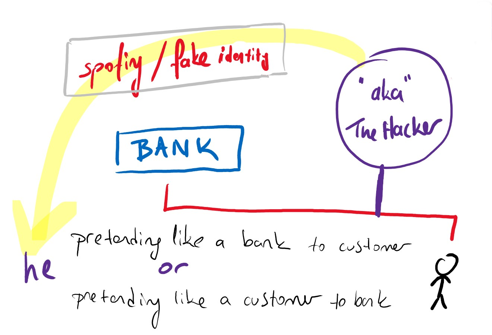

# DNS güvenlik açıkları, Çözüm yolları ve yaklaşımları

## DNS Güvenliği neden önemlidir?

Hemen hemen tüm web trafiği için gerekli olan standart DNS sorguları, DNS korsanlığı (hijacking) ve yol üzerinde saldırılar (on-path attacks) gibi DNS istismarları (exploits) için fırsatlar yaratır. Bu saldırılar, bir web sitesinin gelen trafiğini sitenin sahte bir kopyasına yönlendirerek hassas kullanıcı bilgilerini toplayabilir ve işletmeleri büyük sorumluluğa maruz bırakabilir. DNS tehditlerine karşı korumanın bilinen en iyi yollarından biri, DNSSEC protokolünü benimsemektir.

## DNSSEC nedir?

Birçok İnternet protokolü gibi, DNS sistemi de güvenlik düşünülerek tasarlanmamıştır ve çeşitli tasarım sınırlamaları içerir. Teknolojideki ilerlemelerle birlikte bu sınırlamalar, saldırganların, kötü amaçlı yazılım dağıtabilecek veya kişisel bilgi toplayabilecek sahte bir web sitesine bir kullanıcıyı göndermek gibi kötü amaçlı amaçlarla DNS aramasını ele geçirmesini kolaylaştırmıştır.

# DNS ile ilgili bazı yaygın saldırılar

## DNS spoofing / cache poisoning

> DNS sahtekarlığı / önbellek zehirlenmesi

Bu, sahte DNS verilerinin bir DNS çözümleyicinin önbelleğine girdiği ve çözümleyicinin bir domain için yanlış bir IP adresi döndürmesine neden olan bir saldırıdır. Doğru web sitesine gitmek yerine trafik, kötü amaçlı bir makineye veya saldırganın istediği başka bir yere yönlendirilebilir; genellikle bu, kötü amaçlı yazılım dağıtmak veya giriş bilgilerini toplamak gibi kötü amaçlar için kullanılan paravan, kopya sitelerdir.

    
     
    <em></em>

## DNS tunneling

> DNS tünelleme

Bu saldırı, DNS sorguları ve yanıtları arasında tünel açmak için diğer protokolleri kullanır. Saldırganlar, kötü amaçlı yazılım veya çalınan bilgileri çoğu güvenlik duvarı tarafından tespit edilmeden DNS sorgularına geçirmek için SSH, TCP veya HTTP kullanabilir.

## DNS hijacking

> DNS kaçırma, korsanlığı, gaspı

DNS hijacking'de saldırgan, sorguları farklı bir alan adı sunucusuna yönlendirir. Bu, kötü amaçlı yazılımlarla veya bir DNS sunucusunda yetkisiz değişiklik yapılarak yapılabilir.

Sonuç DNS spoofing'e benzer olsa da, bu temelde farklı bir saldırıdır çünkü web sitesinin DNS kaydını bir çözümleyicinin önbelleğinden ziyade ad sunucusunda hedefler.

    
     
    <em></em>

## NXDOMAIN attack

Bu, bir saldırganın, meşru trafik için hizmet reddine neden olmak amacıyla mevcut olmayan kayıtları soran taleplerle bir DNS sunucusuna baskın yaptığı bir tür DNS flood saldırısıdır.

Bu, her istek için otomatik olarak benzersiz subdomain'ler oluşturabilen gelişmiş saldırı araçları kullanılarak gerçekleştirilebilir.

NXDOMAIN saldırıları, çözümleyicinin önbelleğini gereksiz isteklerle doldurmak amacıyla özyinelemeli bir çözümleyiciyi de hedefleyebilir.

    
     
    <em></em>

## **Phantom domain attack**

> Hayalet etki alanı saldırısı

**Phantom domain attack**, DNS çözümleyiciye yapılan NXDOMAIN saldırısına benzer bir sonuca sahiptir. Saldırgan, isteklere çok yavaş yanıt veren veya hiç yanıt vermeyen bir dizi **"phantom (hayali)"** domain server'ler kurar. Çözümleyici daha sonra bu domain'lere gelen bir talep seliyle vurulur ve çözümleyici yanıtları beklerken bağlanır, bu da yavaş performansa ve hizmet reddine yol açar.

## Random subdomain attack

Bu saldırıda saldırganlar, bir sitenin aslında var olmayan, rastgele üretilmiş, birkaç subdomain'i için DNS sorguları gönderir. Amaç, alan adının yetkili ad sunucusu için bir hizmet reddi oluşturarak web sitesinin ad sunucusunda sorgulanmasını imkansız hale getirmektir.

## Domain lock-up attack

Saldırganlar, diğer yasal çözümleyicilerle TCP bağlantıları oluşturmak için özel domain'ler ve çözümleyiciler kurarak bu tür saldırıları düzenler. Hedeflenen çözümleyiciler istek gönderdiğinde, bu domain'ler yavaş yavaş rastgele paket akışları göndererek çözümleyicinin kaynaklarını bağlar, (kitler, boşa yorar).

## Botnet-based CPE attack

...

...

..

---

# DNS tabanlı saldırılara karşı korumanın en iyi yolu nedir?

DNSSEC'e ek olarak, bir DNS bölgesinin operatörü, sunucularını korumak için başka önlemler alabilir. Aşırı provizyon altyapısı, DDoS saldırılarının üstesinden gelmek için basit bir stratejidir. Basitçe söylemek gerekirse, ad sunucunuz beklediğinizden birkaç kat daha fazla trafiği idare edebiliyorsa, hacim tabanlı bir saldırının sunucunuzu alt etmesi daha zordur.

**Anycast routing** (Anycast yönlendirme), DDoS saldırılarını engelleyebilecek başka bir kullanışlı araçtır. Anycast, birden fazla ad sunucusunun tek bir IP adresini paylaşmasına izin verir, bu nedenle bir DNS sunucusu kapatılsa bile, diğerleri açık ve hizmet vermeye devam edecektir.

DNS sunucularının güvenliğini sağlamak için bir başka popüler strateji, DNS güvenlik duvarıdır.

## DNS firewall nedir?

DNS güvenlik duvarı, DNS sunucuları için bir dizi güvenlik ve performans hizmeti sağlayabilen bir araçtır. Bir DNS güvenlik duvarı, bir kullanıcının özyinelemeli çözümleyicisi ile ulaşmaya çalıştığı web sitesi veya hizmetin yetkili ad sunucusu arasında bulunur. Güvenlik duvarı, sunucuyu alt etmeye çalışan saldırganları kapatmak için hız sınırlama hizmetleri sağlayabilir. 

Ayrıca; sunucu, bir saldırı sonucunda veya başka bir nedenle kesinti yaşarsa, DNS güvenlik duvarı, önbellekten DNS yanıtları sunarak operatörün sitesini veya hizmetini çalışır durumda tutabilir.

    
     
    <em></em>

DNS güvenlik duvarı, güvenlik özelliklerine ek olarak bir DNS operatörü için daha hızlı DNS aramaları ve azaltılmış bant genişliği maliyetleri gibi **performans** çözümleri de sağlayabilir.

## Güvenlik aracı olarak DNS

DNS çözümleyicileri, son kullanıcıları (İnternet'te gezinen kişiler) için güvenlik çözümleri sağlamak üzere yapılandırılabilir. Bazı DNS çözümleyiciler, kötü amaçlı yazılım ve spam dağıttığı bilinen siteleri engelleyebilen içerik filtreleme ve bilinen botnet'lerle iletişimi engelleyen botnet koruması gibi özellikler sağlar. Bu güvenli DNS çözümleyicilerin çoğunun kullanımı ücretsizdir ve bir kullanıcı, yerel yönlendiricisindeki tek bir ayarı değiştirerek bu recuresive DNS hizmetlerinden birine geçiş yapabilir.

## DNS sorguları gizli, gözlenebilir midir?

Bir diğer önemli DNS güvenlik sorunu, kullanıcı gizliliğidir. DNS sorguları şifrelenmez. Kullanıcılar 1.1.1.1 gibi etkinliklerini izlemeyen bir DNS çözümleyici kullansalar bile, DNS sorguları İnternet üzerinden düz metin olarak dolaşır. Bu, sorguyu kesen herkesin, **kullanıcının hangi web sitelerini ziyaret ettiğini görebileceği** anlamına gelir.

    
     
    <em></em>

Bu mahremiyet eksikliği, güvenlik ve bazı durumlarda insan hakları üzerinde bir etkiye sahiptir; DNS sorguları özel değilse, hükümetlerin İnternet'i sansürlemesi ve saldırganların kullanıcıların çevrimiçi davranışlarını takip etmesi daha kolay hale gelir.

[**DNS over TLS and DNS over HTTPS**](https://www.cloudflare.com/en-gb/learning/dns/dns-over-tls/), harici tarafların bunları okuyabilmesini önlemek için DNS sorgularını şifrelemeye yönelik iki standarttır.

    
     
    <em></em>

## Kaynaklar

- [https://www.cloudflare.com/en-gb/learning/dns/dns-security/](https://www.cloudflare.com/en-gb/learning/dns/dns-security/)
- [https://securitytrails.com/blog/most-popular-types-dns-attacks](https://securitytrails.com/blog/most-popular-types-dns-attacks)

***Görsellerin kaynakları:*** 

- [https://github.com/hasantezcan/computer-networks-notes/blob/main/_data/weeks/week1/Compute-Networks-and-the-Internet.md](https://github.com/hasantezcan/computer-networks-notes/blob/main/_data/weeks/week1/Compute-Networks-and-the-Internet.md)
- [https://www.cloudflare.com/en-gb/learning/dns/dns-security/](https://www.cloudflare.com/en-gb/learning/dns/dns-security/)
- [https://securizando.com/denegacion-servicio-servidores-dns/](https://securizando.com/denegacion-servicio-servidores-dns/)
- [https://www.cloudflare.com/en-gb/dns/dns-firewall/](https://www.cloudflare.com/en-gb/dns/dns-firewall/)
- [https://www.cloudflare.com/en-gb/learning/dns/dns-over-tls/](https://www.cloudflare.com/en-gb/learning/dns/dns-over-tls/)